MIT License

Copyright (c) 2025 TikrTracker

Permission is hereby granted, free of charge, to any person obtaining a copy
of this software and associated documentation files (the "Software"), to deal
in the Software without restriction, including without limitation the rights
to use, copy, modify, merge, publish, distribute, sublicense, and/or sell
copies of the Software, and to permit persons to whom the Software is
furnished to do so, subject to the following conditions:

The above copyright notice and this permission notice shall be included in all
copies or substantial portions of the Software.

THE SOFTWARE IS PROVIDED "AS IS", WITHOUT WARRANTY OF ANY KIND, EXPRESS OR
IMPLIED, INCLUDING BUT NOT LIMITED TO THE WARRANTIES OF MERCHANTABILITY,
FITNESS FOR A PARTICULAR PURPOSE AND NONINFRINGEMENT. IN NO EVENT SHALL THE
AUTHORS OR COPYRIGHT HOLDERS BE LIABLE FOR ANY CLAIM, DAMAGES OR OTHER
LIABILITY, WHETHER IN AN ACTION OF CONTRACT, TORT OR OTHERWISE, ARISING FROM,
OUT OF OR IN CONNECTION WITH THE SOFTWARE OR THE USE OR OTHER DEALINGS IN THE
SOFTWARE.

---

# TikrTracker

TikrTracker is an automated algorithmic stock trading and analysis platform built with **Laravel 12**, **React 19 / Inertia v2**, and **Tailwind CSS v4**. It integrates with the **Alpaca Markets API** for live  trading and provides a comprehensive suite of market data pipelines, backtesting engines, ML-based signal scoring, and real-time dashboards.

You will need an alpaca account for this application to work.  You can open an account and just use paper trading which does not make real trades. Then change to a production account and fund if you want to make real trades.

## Core Capabilities

### Automated Trading Pipelines
Over a dozen modular trading pipelines (A–S) scan the market on configurable time boundaries, generate trade alerts with ML confidence scores, and automatically place buy orders with trailing stop-losses. Pipeline behavior — including time slots, entry filters, risk gates, and trading hours — is fully configurable through a web-based Trading Settings dashboard.

### Market Data Infrastructure
Real-time and historical market data is ingested from Alpaca via scheduled commands and WebSocket streaming. Intraday data is stored in 1-minute and 5-minute resolution tables, with optional "full" history tables for backfills. A cron-driven scheduler manages:
- 1-minute and 5-minute bar syncing throughout the trading day
- Daily price generation from intraday data
- Technical indicator calculations (RSI, Bollinger Bands, ATR, VWAP)
- Market schedule and holiday tracking

### ML Scoring & Backtesting
Trade alerts are scored by an ML model that predicts win probability based on multi-timeframe features (daily, weekly, intraday momentum, volume patterns, etc.). Pipelines use these scores as gates for order placement. A full backtesting system replays historical data through the same pipeline logic to validate strategies before live deployment.

### Stop-Loss & Risk Management
Automated trailing stop-losses are placed on every filled buy order. The system reconciles fill status, cancels stale stop orders, and creates replacement stops as positions move. Profit protection rules tighten stops automatically at configurable thresholds.

### Automatic Position Sizing
The system supports both fixed and dynamic position sizing modes. In dynamic mode, position sizes are calculated based on account equity, configured risk percentages, and symbol-level liquidity analysis. The slippage-aware sizing rule analyzes recent order fill history to classify symbols into low, medium, or high liquidity tiers, automatically adjusting position sizes to avoid excessive slippage on thinly traded stocks. Minimum and maximum position size guardrails protect against over-concentration while ensuring orders meet exchange minimums.

### Bad Trade High-Spread Blocking
Before placing buy orders, the system checks real-time bid/ask spreads against a configurable maximum spread threshold (default 0.35%). Trades on symbols with excessive spreads are automatically blocked to prevent entering positions with unfavorable pricing. The spread check runs against live quote data streamed via Alpaca WebSocket, ensuring decisions are based on current market conditions.

### Market Strength & Movers
A market regime engine scores each trading day based on explosive 5-minute price movements, helping identify strong, moderate, or weak market environments. Top movers are surfaced with symbol-level detail across configurable lookback windows (7D–90D).

### Real-Time Dashboards
- **Live Alpaca orders & positions** with P&L tracking, slippage analysis, and daily performance summaries
- **Trade alert tables** with filtering by pipeline, date, win/loss, and ML score
- **Watchlists** with interactive candlestick charts, live quotes, and multi-timeframe analysis
- **Market data asset pages** with 1-year chart history, bid/ask spread, and live polling during trading hours

### Analysis Toolkit
Dozens of analysis views provide advanced screening of trade candidates:
- Rising stocks since close, upward pressure detection, VWAP status
- Bottom detection, breakout confirmation, buy zone top performers
- Hybrid momentum scans, buy window analysis, individual symbol scoring
- Pipeline latency tracing, backtest-vs-actual comparison, and ML threshold optimization

### System Monitoring
Built-in observability tools track pipeline execution, queue health, Redis keys, MySQL query performance, CPU temperature, and process status — all accessible through the web UI.

## Tech Stack

| Layer | Technology |
|---|---|
| Backend | Laravel 12, PHP 8.4 |
| Frontend | React 19, Inertia v2, Tailwind CSS v4 |
| Database | MySQL with Eloquent ORM |
| Caching | Redis (Predis) |
| Real-Time | Laravel Reverb, Laravel Echo, Pusher |
| Trading API | Alpaca Markets Python API|
| ML | Custom ML model scoring pipeline using Python and XGBoost |
| Testing | Pest v4, PHPUnit |
| Code Quality | Laravel Pint, ESLint, Prettier |
| Process Control| Supervisor |

---

## Sitemap

### Dashboard
- **[Dashboard](http://127.0.0.1:8080/dashboard)** — Main overview dashboard
  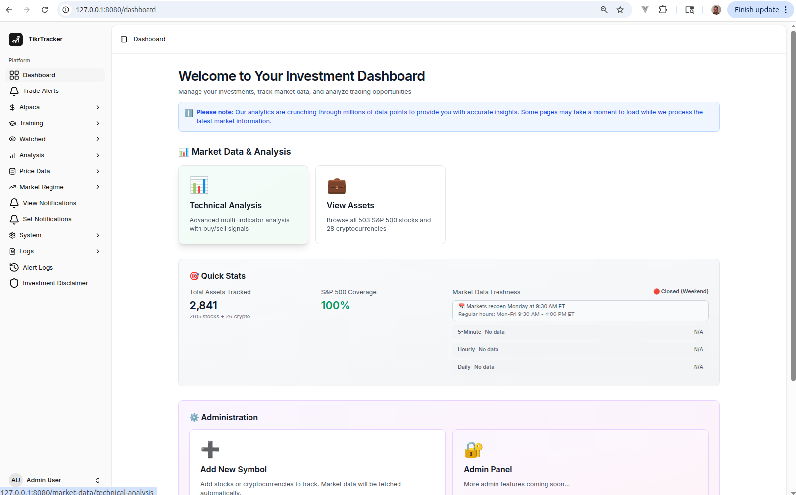
- [Market Data Assets](http://127.0.0.1:8080/market-data/assets) — Lists all investable asset symbols (stocks & crypto) filterable by type and searchable by symbol
  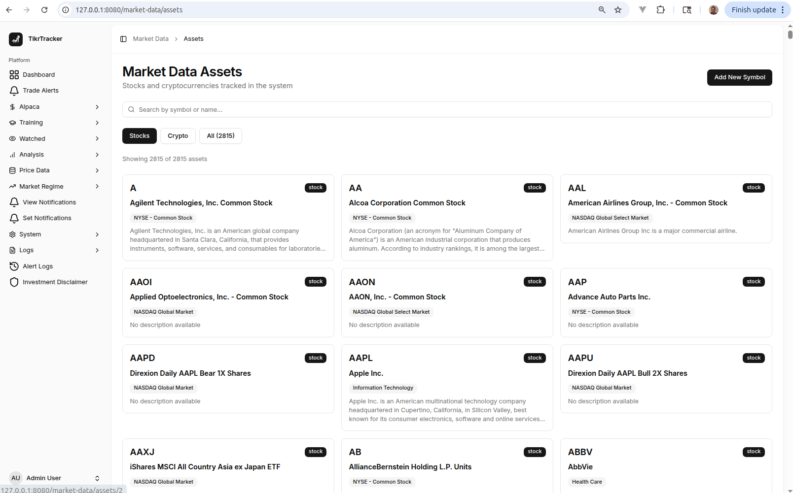
- [Technical Analysis](http://127.0.0.1:8080/market-data/technical-analysis) — Displays technical analysis recommendations with RSI scores, price changes, and market status
- [Asset Detail (Example: AAPL)](http://127.0.0.1:8080/market-data/assets/8) — Shows detailed asset info with candlestick charts, price stats, and daily history
  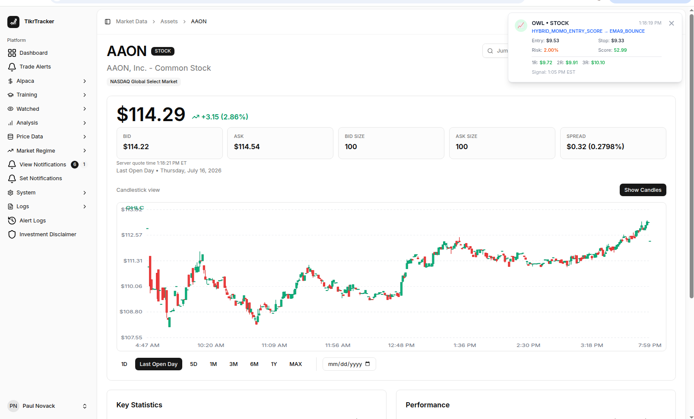
  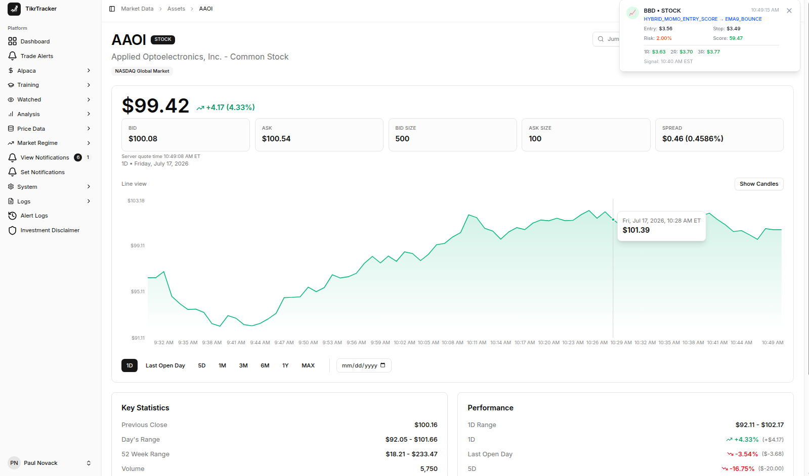

### Trade Alerts
- **[Trade Alerts](http://127.0.0.1:8080/trade-alerts)** — Real-time and historical trade alert signals with entry prices, stop levels, risk metrics, and ML win probabilities

### Alpaca Trading
- [Place Order](http://127.0.0.1:8080/alpaca-place-order) — Manual order placement with symbol search, today's alerts quick-select, and price/stop fields
- [View Orders](http://127.0.0.1:8080/alpaca-orders) — Paginated view of all orders with current market prices, fill status, and order details
  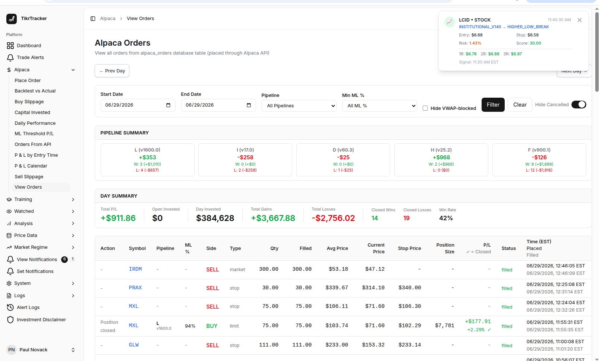
- [Orders From API](http://127.0.0.1:8080/alpaca-orders-api) — Direct Alpaca API order retrieval by date range with live price lookup
  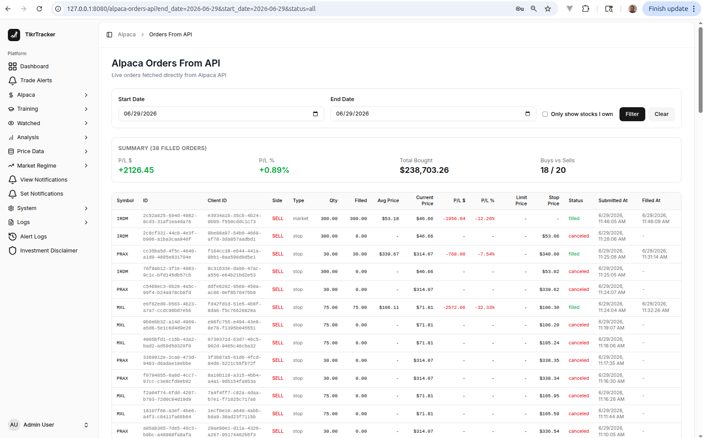
- [Daily Performance](http://127.0.0.1:8080/alpaca-daily-performance) — Expandable daily P&L breakdown per symbol with individual trades, win/loss stats, and summaries
- [Buy Slippage](http://127.0.0.1:8080/alpaca-buy-slippage) — Analyzes buy order slippage vs market price one minute later with aggregate statistics
- [Sell Slippage](http://127.0.0.1:8080/alpaca-sell-slippage) — Analyzes sell order slippage vs market price one minute later with per-order breakdown
- [Capital Invested](http://127.0.0.1:8080/alpaca-capital-invested) — Timeline of capital deployed with running totals, daily peaks, and position sizing analysis
  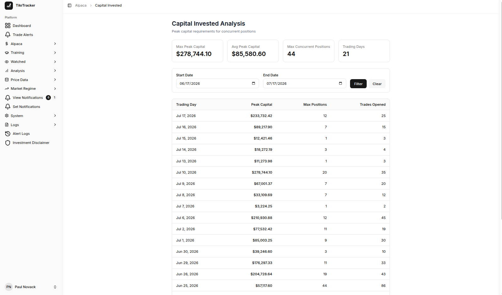
  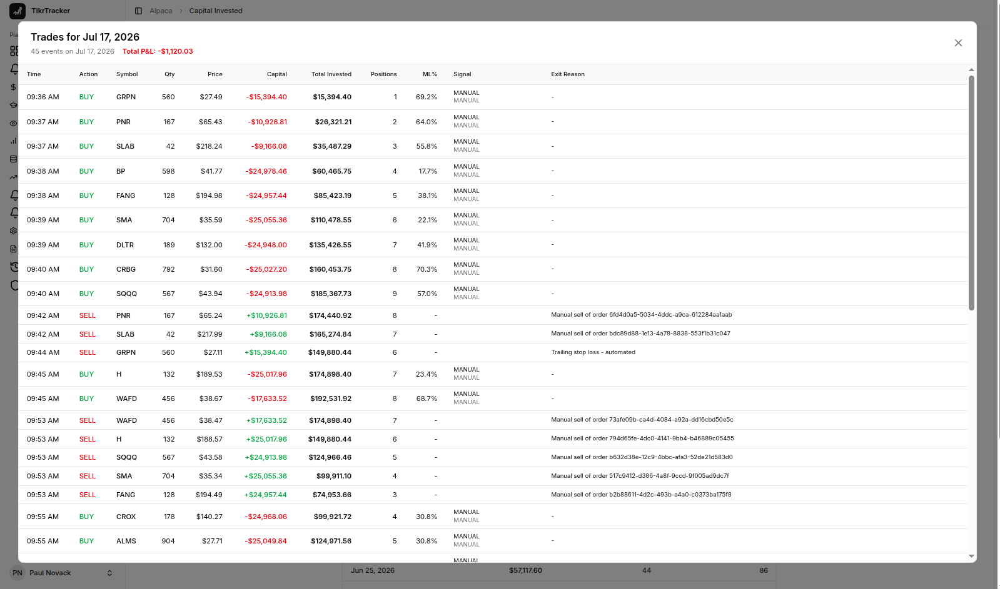
- [P&L by Entry Time](http://127.0.0.1:8080/alpaca-pl-by-entry-time) — Buckets trades by time-of-day to show which entry windows produce the best P&L and win rates
- [P&L Calendar](http://127.0.0.1:8080/alpaca-calendar) — Monthly calendar heatmap of daily P&L totals with trade counts and win/loss breakdowns
- [Backtest vs Actual](http://127.0.0.1:8080/backtest-vs-actual) — Side-by-side comparison of backtest predictions vs actual filled trade outcomes
  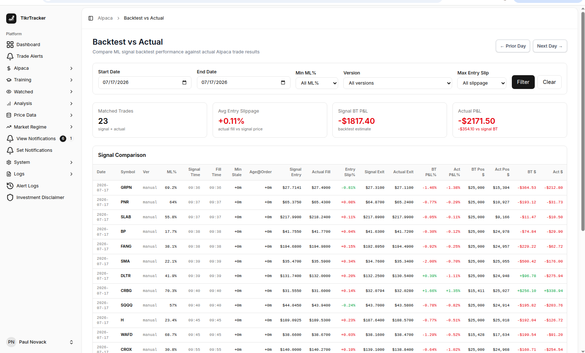
- [ML Threshold P/L](http://127.0.0.1:8080/analysis/ml-threshold-profit-loss) — Analyzes P&L at different ML confidence thresholds
  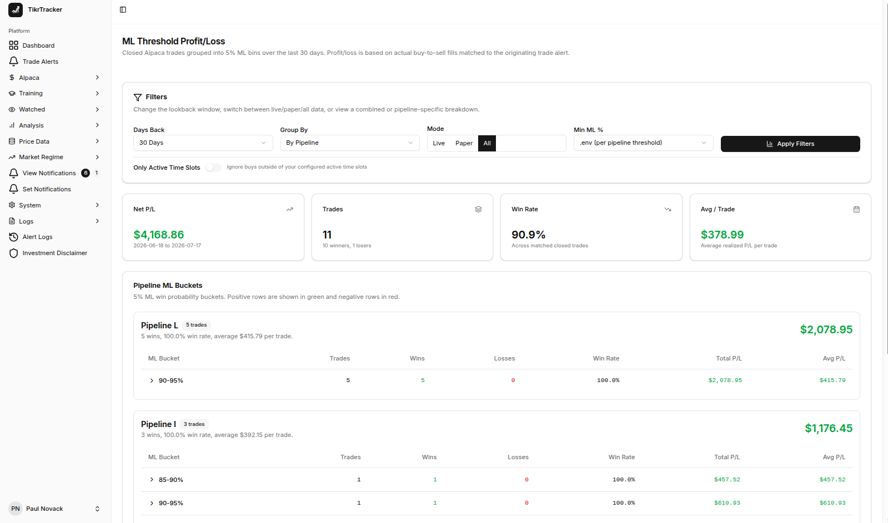

### Training
- [Analyze Trade Alerts](http://127.0.0.1:8080/training/analyze-trade-alerts) — Analyze trade alert quality and outcomes
- [Retrain Models](http://127.0.0.1:8080/training/retrain-models) — Retrain ML scoring models with latest data
- [Rescore Alert](http://127.0.0.1:8080/training/rescore-alert) — Re-run ML scoring on historical alerts

### Watched
- [View Watches](http://127.0.0.1:8080/watches) — Watch list with mini price charts, gains/losses, volume, and 52-week stats
  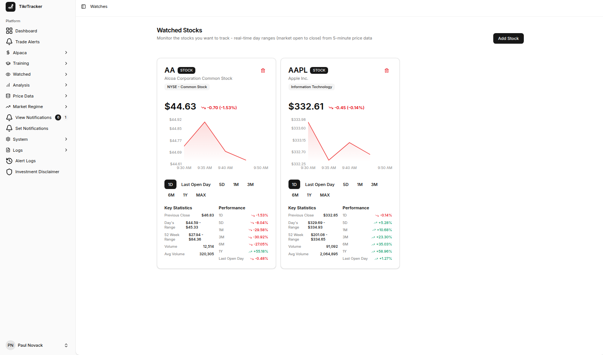
- [Set Watches](http://127.0.0.1:8080/watches/settings) — Add/remove assets from your watch list with slot limit tracking
- [CSV Set Watches](http://127.0.0.1:8080/watches/csv) — Bulk-add stocks using comma-separated symbols with validation
- [My Hour](http://127.0.0.1:8080/my-hour) — One-hour rolling price performance for watched stocks with interval-by-interval changes
- [Watched Analysis](http://127.0.0.1:8080/watched-analysis) — Stagnation analysis identifying flat, downtrending, and gaining assets

### Analysis
- [5-Min VWAP Status](http://127.0.0.1:8080/analysis/vwap-status) — Monitors whether the benchmark symbol's current price is above or below VWAP
- [Backtest TA Results](http://127.0.0.1:8080/backtest-results) — Backtest trade results with per-trade P&L, win/loss, risk metrics, and ML probabilities
- [Best Gains 7 Days](http://127.0.0.1:8080/analysis/best-gains-7d) — Ranks stocks by best percentage returns over a configurable number of days
- [Bottom Detect](http://127.0.0.1:8080/analysis/bottom-detect) — Scans for bottoming patterns using RSI oversold, base-building, and volume reclaim signals
- [Breakout](http://127.0.0.1:8080/analysis/breakout) — Detects momentum breakout candidates using move %, noise filtering, and volume surge metrics
- [Breakout Confirmed](http://127.0.0.1:8080/analysis/breakout-confirmed) — Confirms breakouts by cross-referencing 1-min momentum with 5-min candlestick confirmation
- [Buy Predictor](http://127.0.0.1:8080/buy-predictor) — Scores stocks using range %, pullback, momentum, VWAP, and moving averages to generate buy recommendations
- [Buy Signals](http://127.0.0.1:8080/buy-signals) — Active buy signals with entry prices, stop losses, EMA/VWAP levels, and ML scores
- [Buy Window](http://127.0.0.1:8080/buy-window) — Scans for stocks within optimal buy windows using composite scoring
- [Buy Zone Top Performers](http://127.0.0.1:8080/analysis/buy-zone-top-performers) — Stocks near 7-day highs with VWAP reclaim, EMA alignment, and position sizing
- [Clean 2H Uptrend](http://127.0.0.1:8080/clean-2h) — Tight-stop momentum picks with trend %, max drawdown, risk score, and consistency metrics
- [Daily Rising 100](http://127.0.0.1:8080/rising) — Stocks rising over 1D–30D with color-coded momentum indicators
- [Gainers & Losers](http://127.0.0.1:8080/analysis/gainers-losers) — Top gainers and losers for a given date with open/close and percentage changes
  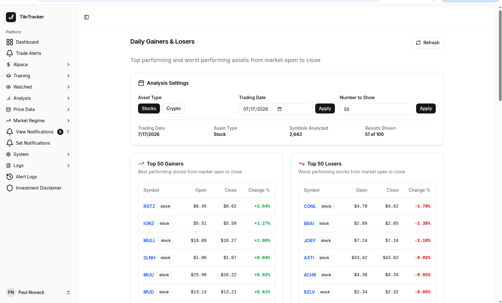
- [Good Long Buy](http://127.0.0.1:8080/analysis/good-long-buy) — Stocks graded as good long buys with limit/stop prices, VWAP/EMA alignment, and risk scores
- [Hybrid Momentum Scan](http://127.0.0.1:8080/hybrid-momentum-scan) — Multi-timeframe momentum scan with volume boost, VWAP distance, and topping detection
- [Last 4 Bars Up](http://127.0.0.1:8080/last-4-bars-up) — Finds stocks with consecutive rising bars and projects forward returns
- [Notable Assets](http://127.0.0.1:8080/notable-assets) — Identifies stagnant, downtrending, or significantly gaining stocks with flag-based classification
- [Pipeline Counts](http://127.0.0.1:8080/analysis/pipeline-counts) — Alert counts per pipeline run with dates, trading days covered, and symbol coverage
- [Risers Not Topped](http://127.0.0.1:8080/risers-not-topped) — Rising stocks without topping patterns across multiple time intervals
- [Rising In Hour](http://127.0.0.1:8080/rising-hour) — Stocks rising within a one-hour window with interval-by-interval tracking
  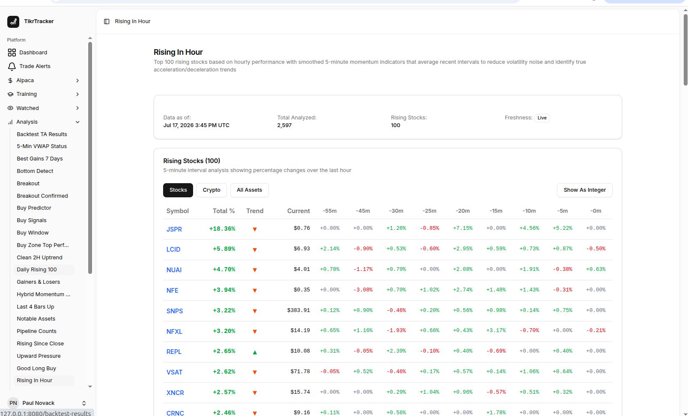
- [Rising Since Close](http://127.0.0.1:8080/analysis/rising-since-close) — Stocks sorted by percentage gain since last market close
- [Rising Stock Analysis](http://127.0.0.1:8080/check-top) — Individual symbol topping pattern analysis with volume and extension metrics
- [Score Symbol](http://127.0.0.1:8080/analysis/score-symbol) — Manually score a single symbol through the ML pipeline for win probability
- [Score Symbol List](http://127.0.0.1:8080/analysis/score-symbol-list) — Batch score multiple symbols with auto-polling progress and aggregate results
- [Sentiments](http://127.0.0.1:8080/sentiments) — Market sentiment entries by date with confidence scores and linked assets
- [Upward Pressure](http://127.0.0.1:8080/analysis/upward-pressure) — Stocks ranked by upward buying pressure using composite body/volume/momentum scoring

### Price Data
- [One Minute](http://127.0.0.1:8080/price-data/one-minute) — Latest one-minute OHLC bar data with symbol, volume, and timestamps
- [Five Minute](http://127.0.0.1:8080/price-data/five-minute) — Latest five-minute OHLC bar data with symbol, volume, and timestamps
- [Daily](http://127.0.0.1:8080/price-data/daily) — Latest daily OHLC price data with trading dates
- [Latest Quotes](http://127.0.0.1:8080/price-data/latest-quotes) — Most recent bid/ask quotes with sizes, exchange, feed source, and timestamps
  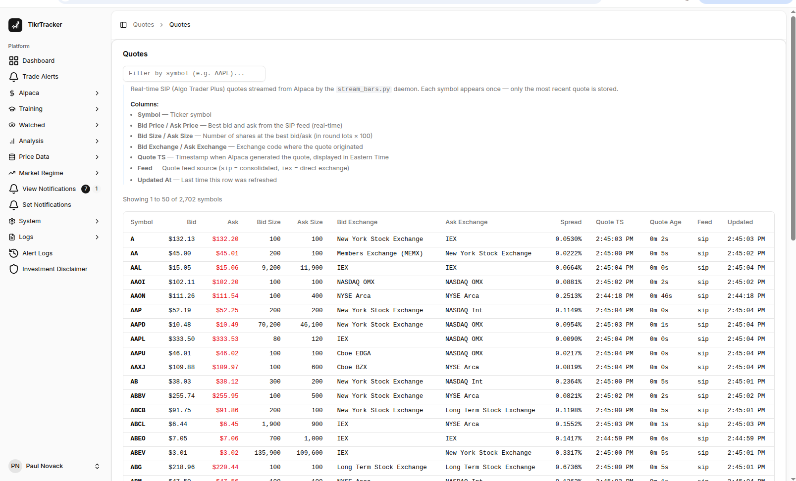

### Market Regime
- [Market Strength](http://127.0.0.1:8080/market-strength) — Daily market strength as STRONG, MODERATE, or WEAK based on explosive bar counts
- [Market Movers](http://127.0.0.1:8080/market-movers) — Daily mover statistics with strength labels, top symbols, and gain percentages
  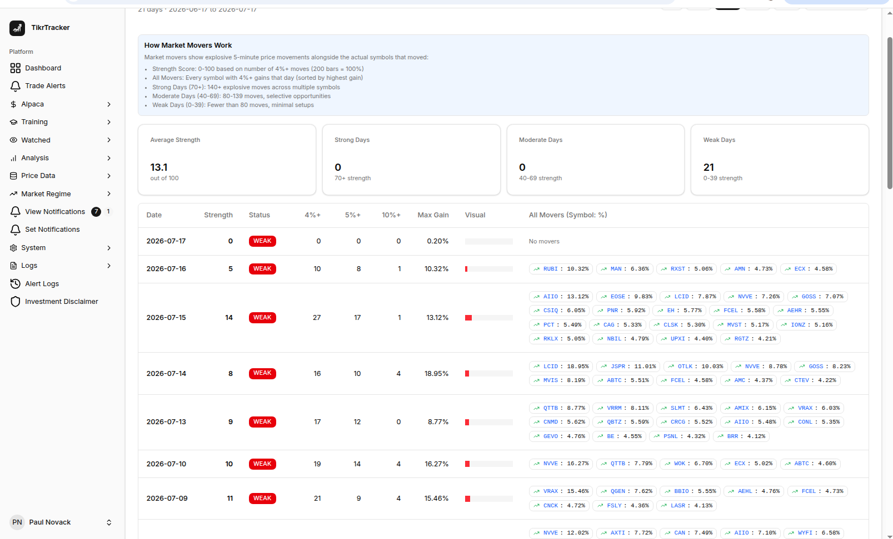

### Notifications
- [View Notifications](http://127.0.0.1:8080/notifications) — User notifications with read/unread state, linked assets, and mark-as-read actions
  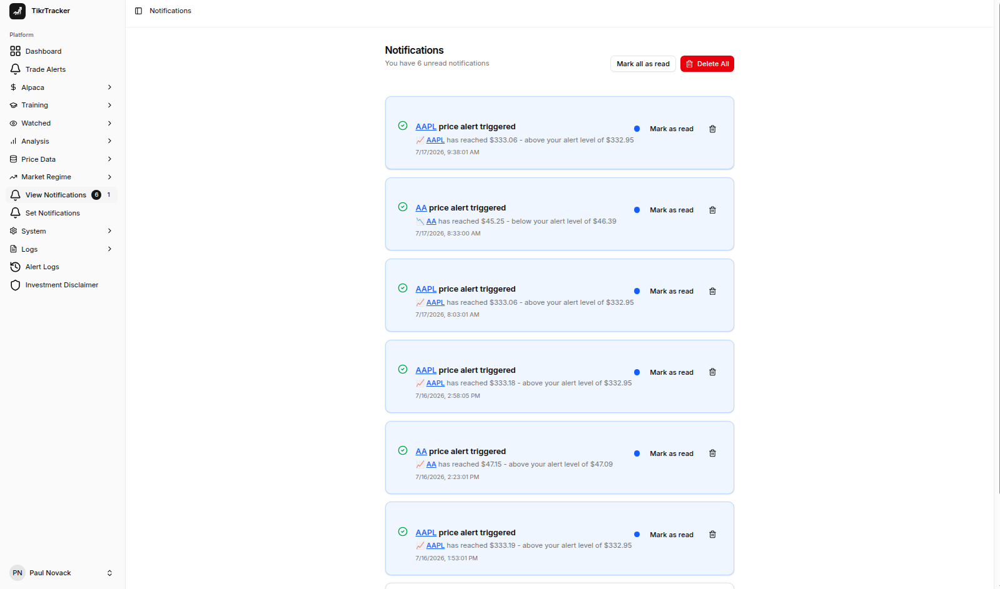
- [Set Notifications](http://127.0.0.1:8080/notifications/settings) — Price alert configurations with % triggers, price thresholds, and enable/disable toggles
  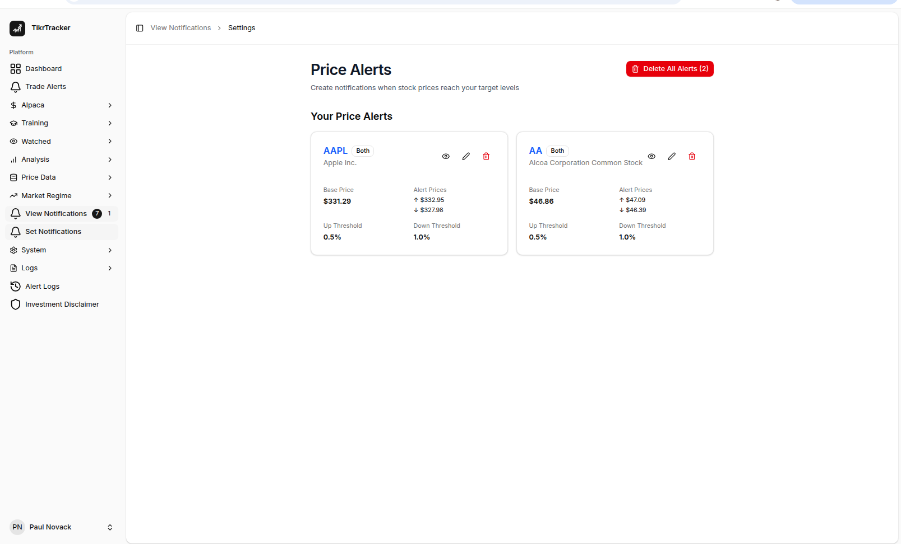

### System (Admin)
- [HTOP](http://127.0.0.1:8080/logs/htop) — Real-time CPU usage with per-core bars, top processes, and system resource panels
  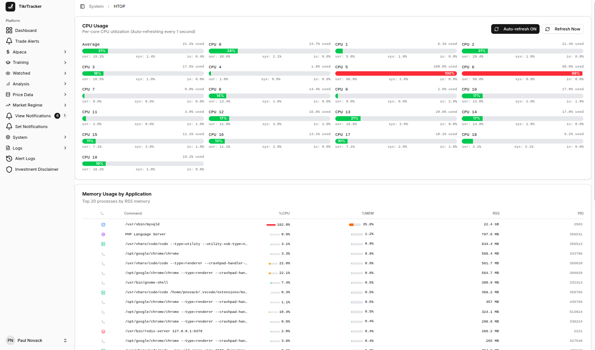
- [CPU Temp](http://127.0.0.1:8080/logs/cpu-temp) — CPU temperature sensor readings with per-section data and fan speeds
  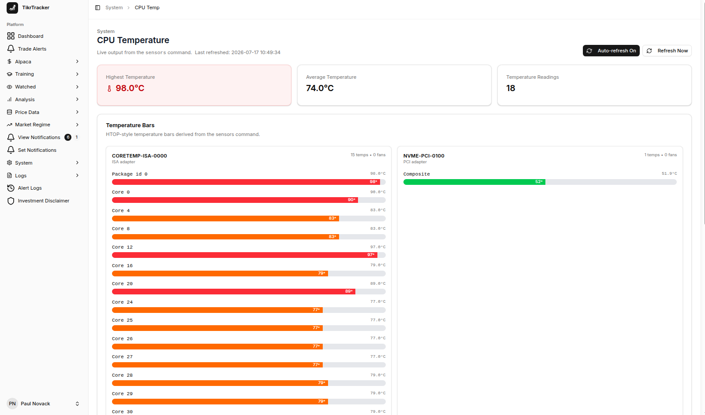
- [Temp Chart](http://127.0.0.1:8080/logs/temp-chart) — Time-series line chart of CPU temperature with multiple sensor series
- [MySQL Health](http://127.0.0.1:8080/mysql-health) — MySQL uptime, connections, slow queries, buffer pool efficiency, and process list
  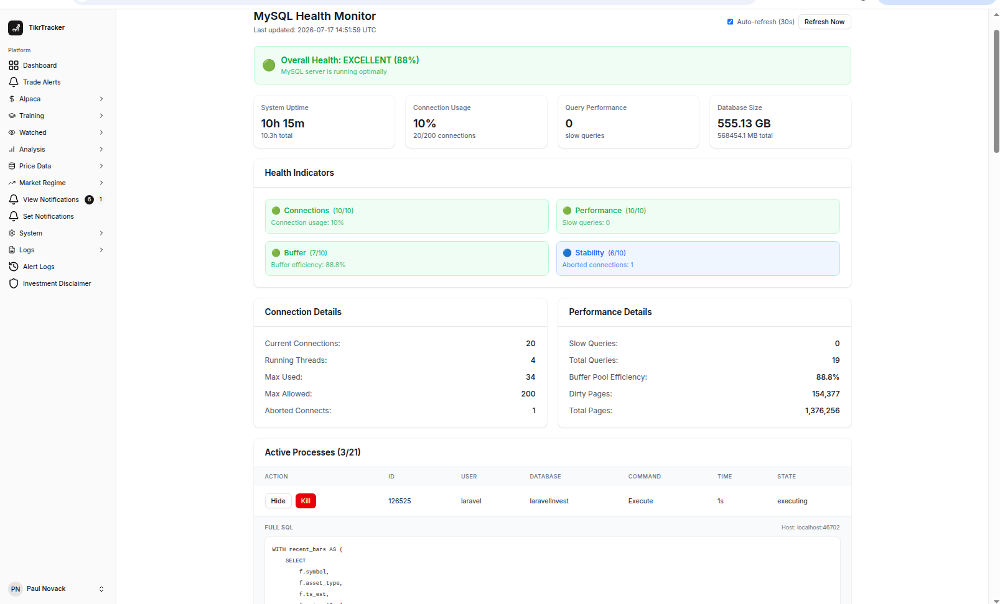
- [Pipeline Observability](http://127.0.0.1:8080/pipeline-observability) — Pipeline health status, hourly throughput charts, skip reasons, and gap alerts
  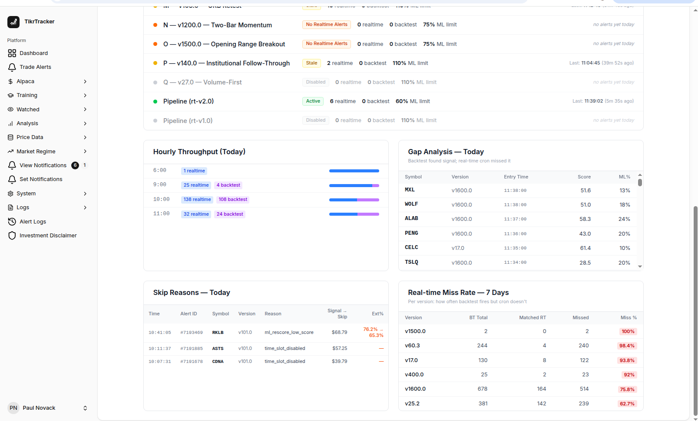
- [Queue Monitor](http://127.0.0.1:8080/queue-monitor) — Queue sizes, worker process states, and Redis memory/client statistics
- [Processes Running](http://127.0.0.1:8080/processes-running) — Running Laravel commands and Python processes with CPU/memory usage
  
- [Trading Settings](http://127.0.0.1:8080/trading-settings) — Paper/live trading config: order enable, loss limits, ML thresholds, position sizing, circuit breakers
  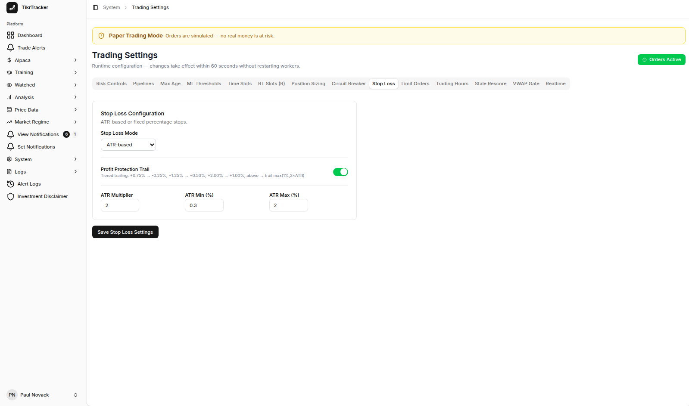
- [Trade Settings 2](http://127.0.0.1:8080/trading-settings-2) — Alpaca credentials, scorer scripts, ML model paths, and pipeline display names
- [Redis Keys](http://127.0.0.1:8080/redis-keys) — Browse Redis key groups by prefix with type breakdowns and key-value inspection
- [Settings Snapshots](http://127.0.0.1:8080/settings-snapshots) — Create and restore named snapshots of trading settings

### Logs (Admin)
- [Continuous BT](http://127.0.0.1:8080/logs/continuous-bt) — Log output from continuous backtest runs per pipeline (A–Q)
- [Laravel](http://127.0.0.1:8080/logs/laravel) — Laravel application log with full-text search, match highlighting, and auto-refresh
  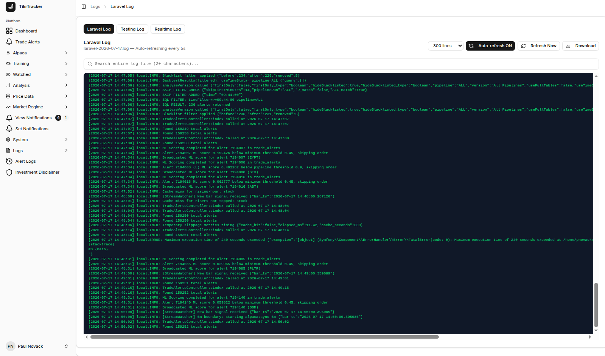
- [Laravel Scheduler](http://127.0.0.1:8080/logs/scheduler) — Scheduler log with full-text search and download capability
- [Streaming Daemons](http://127.0.0.1:8080/logs/streaming) — Bar stream and pipeline watcher logs with color-coded timestamps and levels
  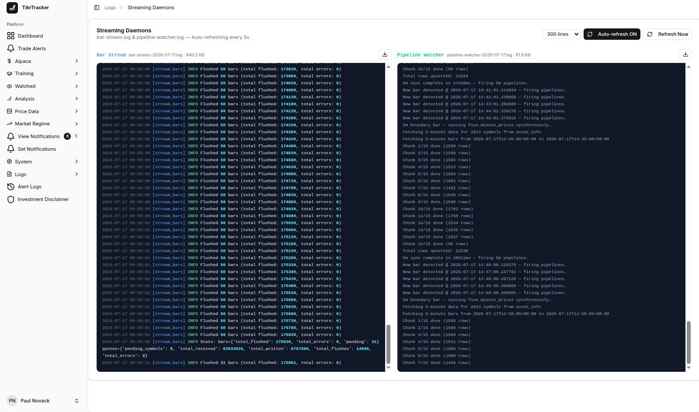
- [Stale Entries](http://127.0.0.1:8080/logs/stale-entries) — Stale entries log for monitoring data staleness issues
- [Realtime Alerts](http://127.0.0.1:8080/logs/realtime-alerts) — Live real-time alert candidates with bid/ask, spread, VWAP, volume ratios, and rejection reasons

### Other
- [Alert Logs](http://127.0.0.1:8080/alert-logs) — Price alert trigger history with trigger prices, direction, and email delivery statuses
  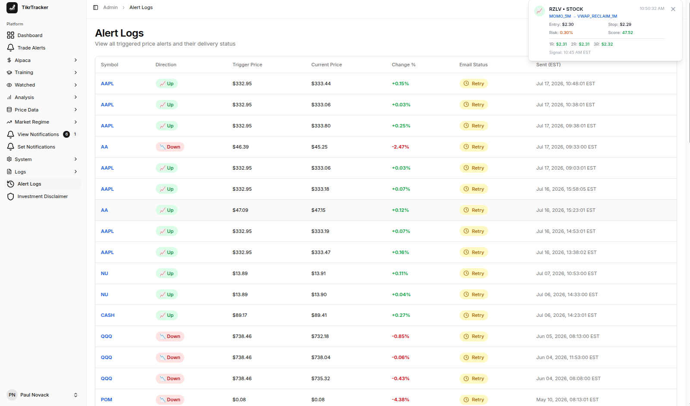
- [Investment Disclaimer](http://127.0.0.1:8080/disclaimer) — Investment disclaimer and acknowledgment required before accessing the application
  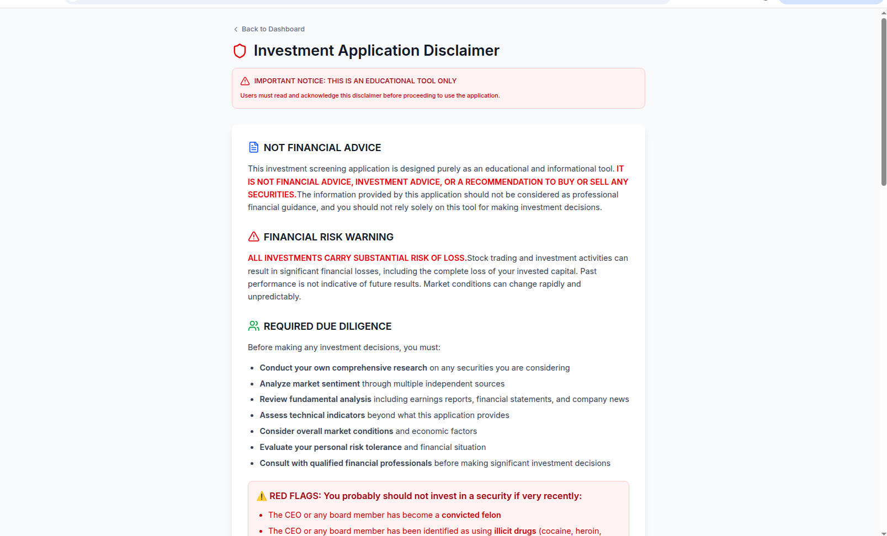

---

Here are some screenshots if you want to see what it does first before installing.

→ **[Installation Guide (INSTALLATION.md)](INSTALLATION.md)** ←

## tikrTracker Page Screenshots:

