# TikrTracker

**TikrTracker** is a full-stack algorithmic trading, market analysis, and strategy research platform built with **Laravel 12**, **React 19**, **Inertia.js v2**, and **Tailwind CSS v4**. It integrates with the **Alpaca Markets API** to support market-data ingestion, automated paper or live trading, machine-learning signal scoring, historical backtesting, risk management, and real-time operational dashboards.

> [!IMPORTANT]
> An Alpaca account is required. New users should begin with **paper trading**, which simulates order execution without placing real-money trades. Live trading should only be enabled after strategies, risk controls, and account settings have been thoroughly validated.

## Table of Contents

- [Overview](#overview)
- [Core Capabilities](#core-capabilities)
- [Technology Stack](#technology-stack)
- [Getting Started](#getting-started)
- [Application Sitemap](#application-sitemap)
- [Risk Notice](#risk-notice)

## Overview

TikrTracker combines trading automation, quantitative analysis, machine learning, and application observability in a single web-based platform. Its modular pipeline architecture supports multiple trading strategies, while shared execution and backtesting logic help maintain consistency between historical testing and real-time operation.

The platform is designed for developers and technically experienced traders who want to research, test, monitor, and automate intraday trading workflows from a configurable interface.

## Core Capabilities

### Modular Trading Pipelines

More than a dozen configurable pipelines scan the market at defined intervals, evaluate entry conditions, generate trade alerts, apply ML confidence gates, and optionally place orders with automated protective stops. Trading hours, entry filters, risk limits, position sizing, and pipeline behavior can be managed through the web-based Trading Settings interface.

### Market-Data Infrastructure

Real-time and historical market data is collected from Alpaca through scheduled commands and WebSocket streams. Intraday data is stored at one-minute and five-minute resolutions, with optional full-history tables for large backfills and research workloads.

The scheduler manages:

- One-minute and five-minute bar synchronization during market hours
- Daily price generation from intraday data
- Technical-indicator calculations, including RSI, Bollinger Bands, ATR, and VWAP
- Trading-calendar, market-session, and holiday tracking

### Machine-Learning Scoring and Backtesting

Trade alerts are evaluated by a Python and XGBoost scoring pipeline that estimates win probability from multi-timeframe price, momentum, volume, and market-context features. ML scores can be used as configurable gates before an order is submitted.

The backtesting engine replays historical data through the same strategy logic used by live pipelines, making it possible to evaluate strategy behavior before enabling automated execution.

### Stop-Loss and Profit Protection

Every filled buy order can receive an automated protective stop. The system monitors fill status, reconciles open positions, cancels stale stop orders, and submits replacement stops as required. Configurable profit-protection rules can progressively tighten stops as a position moves in the intended direction.

### Dynamic Position Sizing

TikrTracker supports fixed and dynamic position sizing. Dynamic sizing considers account equity, configured risk limits, symbol-level liquidity, and historical slippage. Symbols may be classified into liquidity tiers so that position sizes can be reduced for thinner markets. Minimum and maximum position-size guardrails help limit concentration and prevent impractical order sizes.

### Bid/Ask Spread Protection

Before submitting a buy order, the platform compares the current bid/ask spread with a configurable maximum threshold, which defaults to **0.35%**. Orders can be blocked when the live spread indicates unfavorable execution conditions. Quote data is sourced from the Alpaca WebSocket stream so the decision reflects current market conditions.

### Market Regime and Movers Analysis

A market-regime engine evaluates each trading day using significant five-minute price movements and classifies the environment as strong, moderate, or weak. Market-mover views provide symbol-level details across configurable lookback periods ranging from 7 to 90 days.

### Real-Time Dashboards

The interface includes dashboards for:

- Alpaca orders, positions, fills, P&L, and daily performance
- Trade alerts with pipeline, date, outcome, and ML-score filtering
- Watchlists with live quotes, candlestick charts, and multi-timeframe analysis
- Asset detail pages with historical charts, bid/ask spreads, and live polling
- Slippage analysis, capital deployment, and time-of-day performance

### Analysis Toolkit

The platform includes dedicated analysis views for rising stocks, upward pressure, VWAP status, breakout confirmation, bottom detection, buy-zone identification, momentum scans, ML calibration, backtest-versus-actual comparisons, and threshold optimization.

### System Monitoring and Observability

Administrative dashboards provide visibility into pipeline execution, queue health, Redis usage, MySQL performance, running processes, CPU temperature, streaming services, scheduler output, and application logs.

## Technology Stack

| Layer | Technology |
|---|---|
| Backend | Laravel 12, PHP 8.4 |
| Frontend | React 19, Inertia.js v2, Tailwind CSS v4 |
| Database | MySQL with Eloquent ORM |
| Caching and Queues | Redis with Predis |
| Real-Time Events | Laravel Reverb, Laravel Echo, Pusher |
| Brokerage and Market Data | Alpaca Markets API and Python SDK |
| Machine Learning | Python, XGBoost, custom feature and scoring pipelines |
| Testing | Pest v4, PHPUnit |
| Code Quality | Laravel Pint, ESLint, Prettier |
| Process Management | Supervisor |

## Getting Started

### Requirements

- An Alpaca Markets account
- Valid Alpaca paper-trading or live-trading API credentials
- The application dependencies and services described in the installation guide

### Recommended First Run

1. Create an Alpaca account and enable paper trading.
2. Complete the project installation and environment configuration.
3. Import or collect market data.
4. Review the Trading Settings dashboard and keep live order placement disabled.
5. Run backtests and paper-trading sessions before considering live execution.

**[Open the Installation Guide](INSTALLATION.md)**

## Application Sitemap

> [!NOTE]
> The links below assume the application is running locally at `http://127.0.0.1:8080`.

### Dashboard
- **[Dashboard](http://127.0.0.1:8080/dashboard)** — Main overview dashboard

  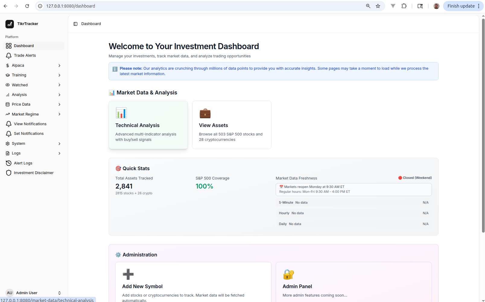
- [Market Data Assets](http://127.0.0.1:8080/market-data/assets) — Lists all investable asset symbols (stocks and cryptocurrencies) filterable by type and searchable by symbol

  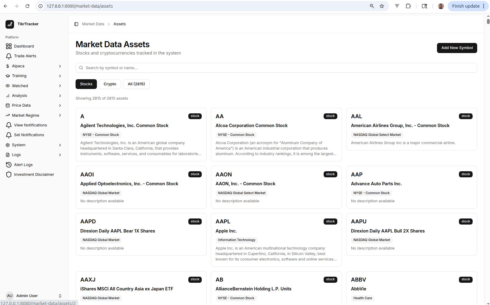
- [Technical Analysis](http://127.0.0.1:8080/market-data/technical-analysis) — Displays technical analysis recommendations with RSI scores, price changes, and market status
- [Asset Detail (Example: AAPL)](http://127.0.0.1:8080/market-data/assets/8) — Shows detailed asset info with candlestick charts, price stats, and daily history.

  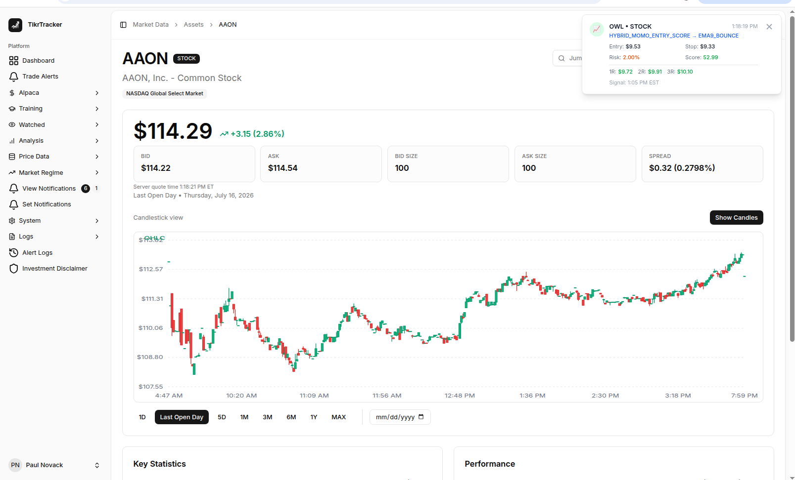

  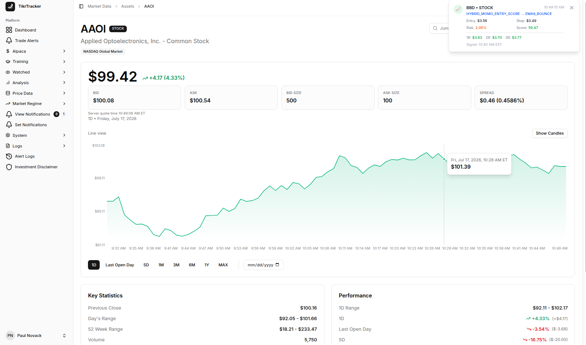
### Trade Alerts
- **[Trade Alerts](http://127.0.0.1:8080/trade-alerts)** — Real-time and historical trade alert signals with entry prices, stop levels, risk metrics, and ML win probabilities

### Alpaca Trading
- [Place Order](http://127.0.0.1:8080/alpaca-place-order) — Manual order placement with symbol search, today's alerts quick-select, and price/stop fields
- [View Orders](http://127.0.0.1:8080/alpaca-orders) — Paginated view of all orders with current market prices, fill status, and order details

  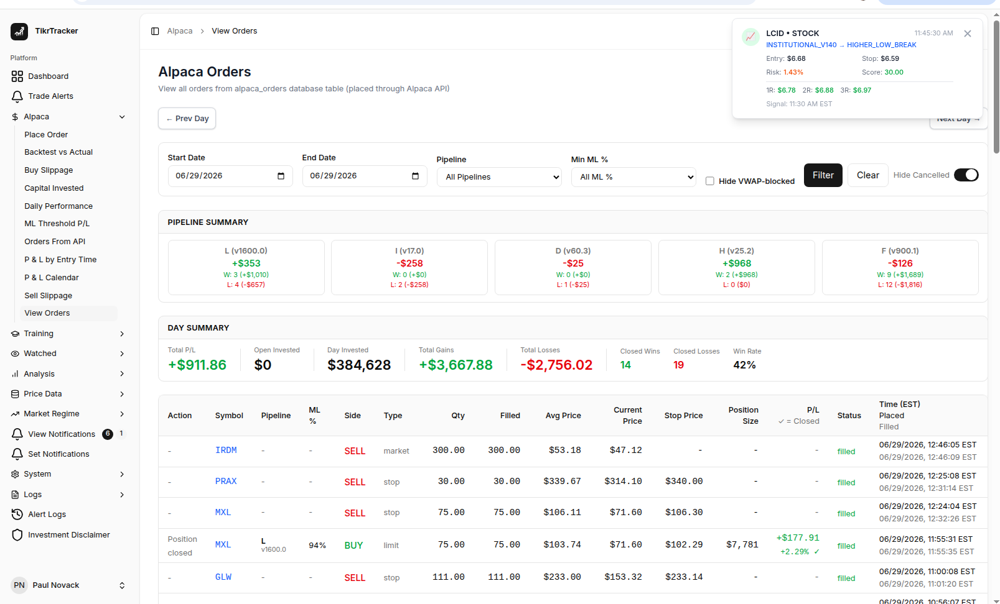
- [Orders From API](http://127.0.0.1:8080/alpaca-orders-api) — Direct Alpaca API order retrieval by date range with live price lookup

  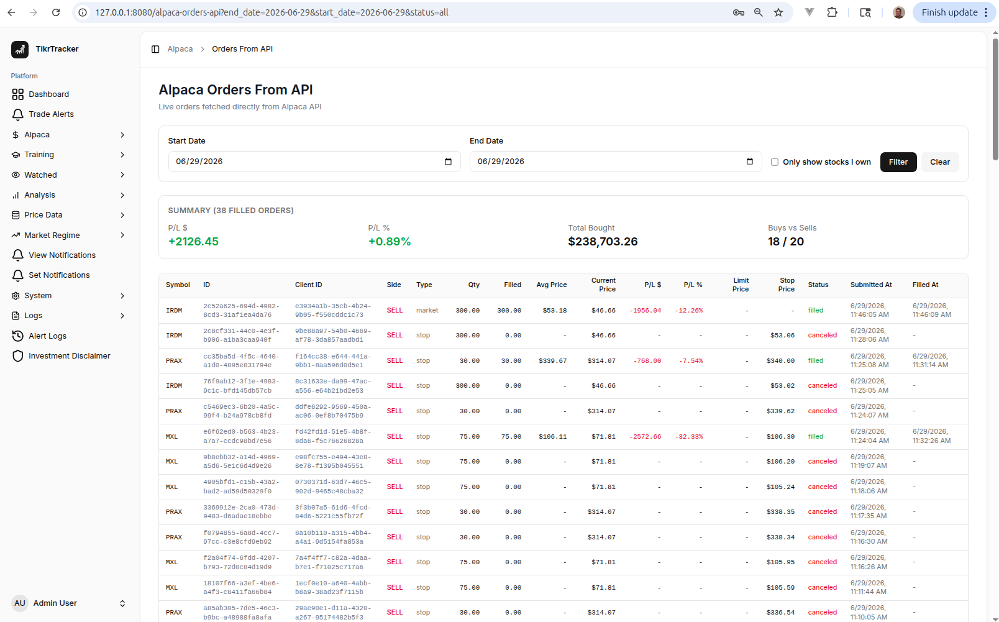
- [Daily Performance](http://127.0.0.1:8080/alpaca-daily-performance) — Expandable daily P&L breakdown per symbol with individual trades, win/loss stats, and summaries
- [Buy Slippage](http://127.0.0.1:8080/alpaca-buy-slippage) — Analyzes buy order slippage vs market price one minute later with aggregate statistics
- [Sell Slippage](http://127.0.0.1:8080/alpaca-sell-slippage) — Analyzes sell order slippage vs market price one minute later with per-order breakdown
- [Capital Invested](http://127.0.0.1:8080/alpaca-capital-invested) — Timeline of capital deployed with running totals, daily peaks, and position sizing analysis.

  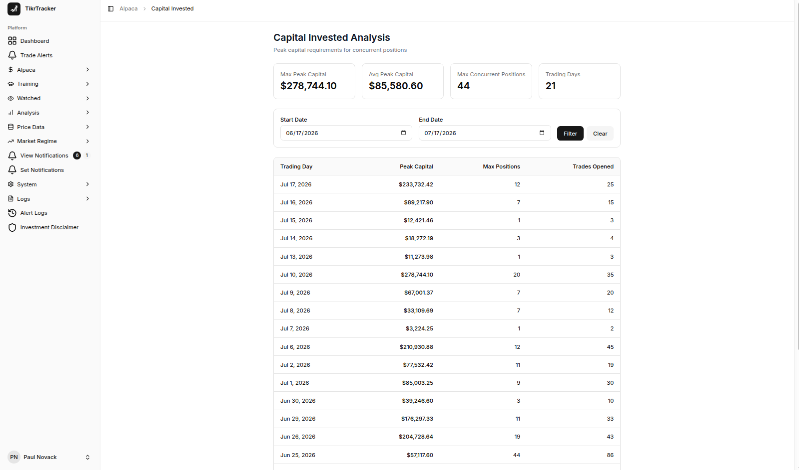

  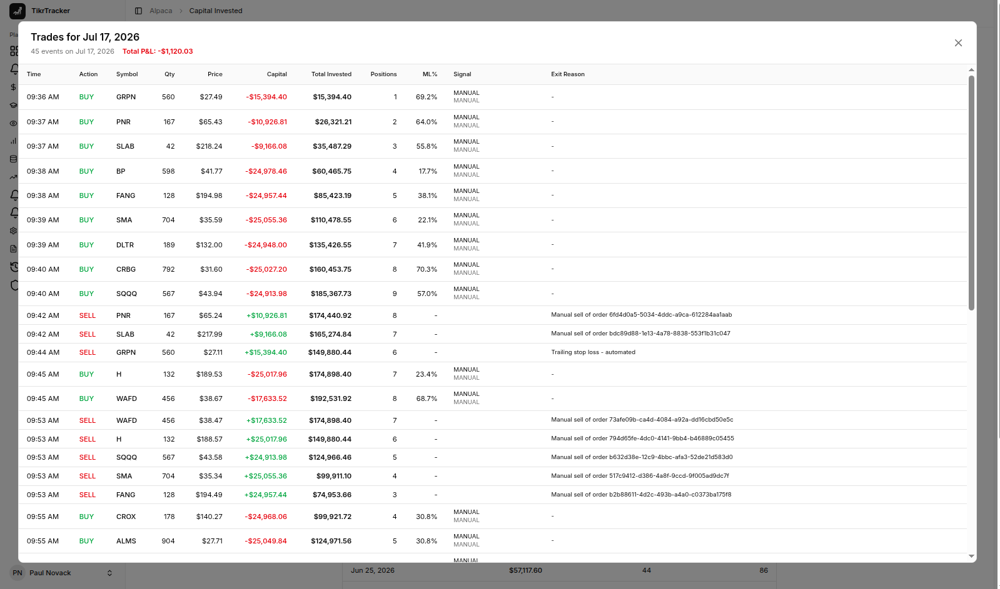
- [P&L by Entry Time](http://127.0.0.1:8080/alpaca-pl-by-entry-time) — Buckets trades by time-of-day to show which entry windows produce the best P&L and win rates
- [P&L Calendar](http://127.0.0.1:8080/alpaca-calendar) — Monthly calendar heatmap of daily P&L totals with trade counts and win/loss breakdowns
- [Backtest vs Actual](http://127.0.0.1:8080/backtest-vs-actual) — Side-by-side comparison of backtest predictions vs actual filled trade outcomes

  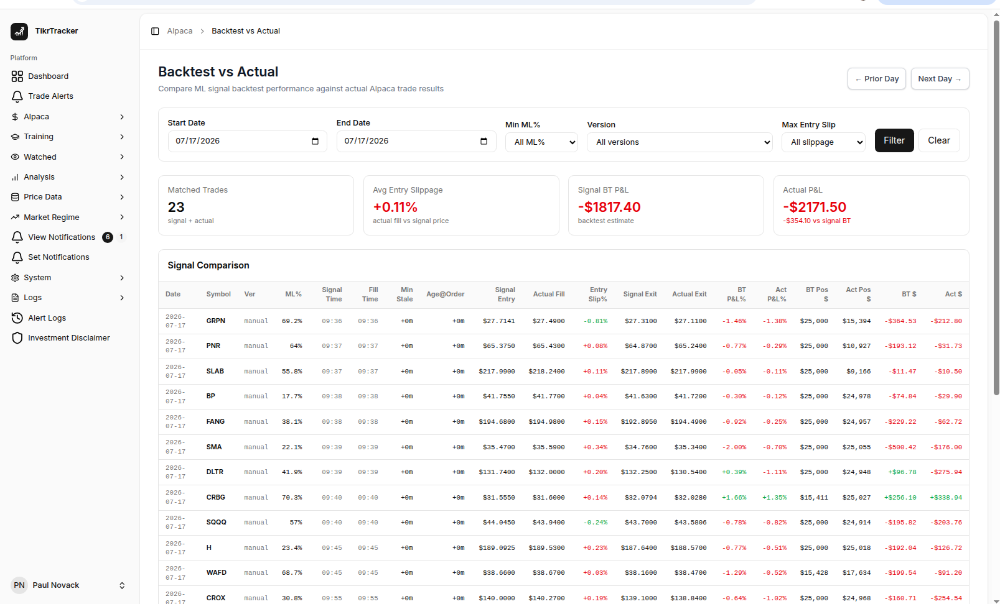
- [ML Threshold P&L](http://127.0.0.1:8080/analysis/ml-threshold-profit-loss) — Analyzes P&L at different ML confidence thresholds

  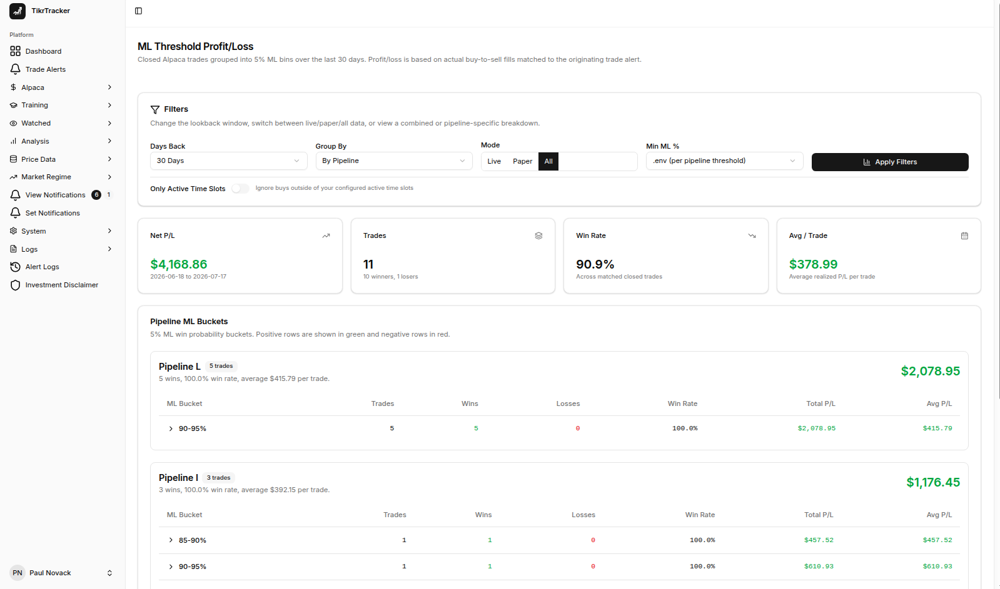
### Training
- [Analyze Trade Alerts](http://127.0.0.1:8080/training/analyze-trade-alerts) — Analyze trade alert quality and outcomes
- [Retrain Models](http://127.0.0.1:8080/training/retrain-models) — Retrain ML scoring models with latest data
- [Rescore Alert](http://127.0.0.1:8080/training/rescore-alert) — Re-run ML scoring on historical alerts
- [Real-Time Training](http://127.0.0.1:8080/training/realtime-training) — Real-time training dashboard for pipeline backtesting against live data
- [Pipeline Backtest](http://127.0.0.1:8080/alpaca-pipeline-backtest) — Pipeline-specific backtest controls and configuration

### Watchlists
- [View Watches](http://127.0.0.1:8080/watches) — Watch list with mini price charts, gains/losses, volume, and 52-week stats

  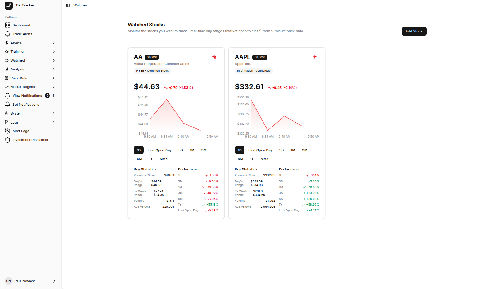
- [Set Watches](http://127.0.0.1:8080/watches/settings) — Add/remove assets from your watch list with slot limit tracking
- [CSV Set Watches](http://127.0.0.1:8080/watches/csv) — Bulk-add stocks using comma-separated symbols with validation
- [My Hour](http://127.0.0.1:8080/my-hour) — One-hour rolling price performance for watched stocks with interval-by-interval changes
- [Watched Analysis](http://127.0.0.1:8080/watched-analysis) — Stagnation analysis identifying flat, downtrending, and gaining assets

### Analysis
- [5-Min VWAP Status](http://127.0.0.1:8080/analysis/vwap-status) — Monitors whether the benchmark symbol's current price is above or below VWAP
- [Backtest TA Results](http://127.0.0.1:8080/backtest-results) — Backtest trade results with per-trade P&L, win/loss, risk metrics, and ML probabilities
- [Best Gains 7 Days](http://127.0.0.1:8080/analysis/best-gains-7d) — Ranks stocks by best percentage returns over a configurable number of days
- [Bottom Detect](http://127.0.0.1:8080/analysis/bottom-detect) — Scans for bottoming patterns using RSI oversold, base-building, and volume reclaim signals
- [Breakout](http://127.0.0.1:8080/analysis/breakout) — Detects momentum breakout candidates using move %, noise filtering, and volume surge metrics
- [Breakout Confirmed](http://127.0.0.1:8080/analysis/breakout-confirmed) — Confirms breakouts by cross-referencing 1-minute momentum with 5-minute candlestick confirmation
- [Buy Predictor](http://127.0.0.1:8080/buy-predictor) — Scores stocks using range %, pullback, momentum, VWAP, and moving averages to generate buy recommendations
- [Buy Signals](http://127.0.0.1:8080/buy-signals) — Active buy signals with entry prices, stop losses, EMA/VWAP levels, and ML scores
- [Buy Window](http://127.0.0.1:8080/buy-window) — Scans for stocks within optimal buy windows using composite scoring
- [Buy Zone Top Performers](http://127.0.0.1:8080/analysis/buy-zone-top-performers) — Stocks near 7-day highs with VWAP reclaim, EMA alignment, and position sizing
- [Clean 2H Uptrend](http://127.0.0.1:8080/clean-2h) — Tight-stop momentum picks with trend %, max drawdown, risk score, and consistency metrics
- [Daily Rising 100](http://127.0.0.1:8080/rising) — Stocks rising over 1D–30D with color-coded momentum indicators
- [Gainers & Losers](http://127.0.0.1:8080/analysis/gainers-losers) — Top gainers and losers for a given date with open/close and percentage changes

  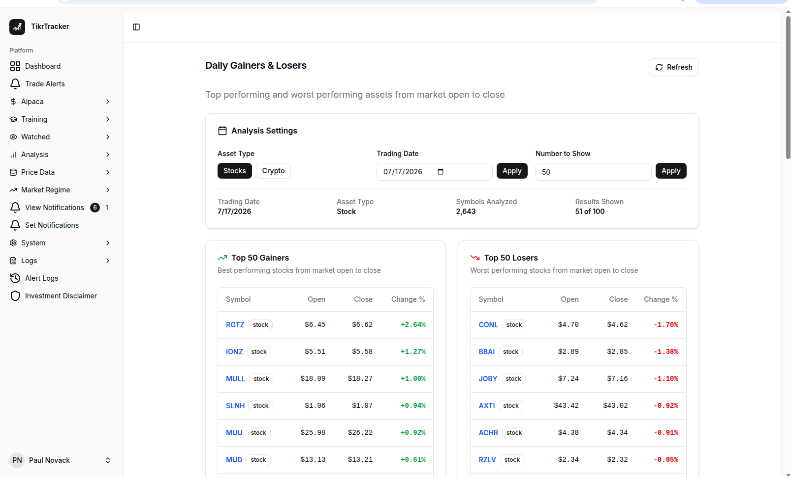
- [Good Long Buy](http://127.0.0.1:8080/analysis/good-long-buy) — Stocks graded as good long buys with limit/stop prices, VWAP/EMA alignment, and risk scores
- [Hybrid Momentum Scan](http://127.0.0.1:8080/hybrid-momentum-scan) — Multi-timeframe momentum scan with volume boost, VWAP distance, and topping detection
- [Last 4 Bars Up](http://127.0.0.1:8080/last-4-bars-up) — Finds stocks with consecutive rising bars and projects forward returns
- [Notable Assets](http://127.0.0.1:8080/notable-assets) — Identifies stagnant, downtrending, or significantly gaining stocks with flag-based classification
- [Pipeline Counts](http://127.0.0.1:8080/analysis/pipeline-counts) — Alert counts per pipeline run with dates, trading days covered, and symbol coverage
- [ML Calibration](http://127.0.0.1:8080/analysis/ml-calibration) — Probability bucket calibration showing actual vs predicted win rates per pipeline, with ML threshold recommendations
- [Risers Not Topped](http://127.0.0.1:8080/risers-not-topped) — Rising stocks without topping patterns across multiple time intervals
- [Rising In Hour](http://127.0.0.1:8080/rising-hour) — Stocks rising within a one-hour window with interval-by-interval tracking

  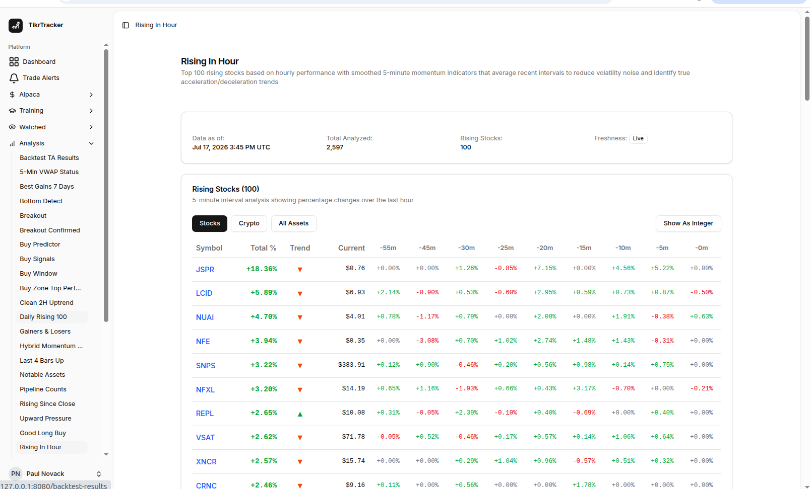
- [Rising Since Close](http://127.0.0.1:8080/analysis/rising-since-close) — Stocks sorted by percentage gain since last market close
- [Rising Stock Analysis](http://127.0.0.1:8080/check-top) — Individual symbol topping pattern analysis with volume and extension metrics
- [Score Symbol](http://127.0.0.1:8080/analysis/score-symbol) — Manually score a single symbol through the ML pipeline for win probability
- [Score Symbol List](http://127.0.0.1:8080/analysis/score-symbol-list) — Batch score multiple symbols with auto-polling progress and aggregate results
- [Sentiments](http://127.0.0.1:8080/sentiments) — Market sentiment entries by date with confidence scores and linked assets
- [Upward Pressure](http://127.0.0.1:8080/analysis/upward-pressure) — Stocks ranked by upward buying pressure using composite body/volume/momentum scoring

### TA-Lib Analysis
- [Daily](http://127.0.0.1:8080/ta-lib-analysis) — Scan for candlestick patterns using TA-Lib across the daily trading universe
- [5 Minute](http://127.0.0.1:8080/ta-lib-analysis/five-minute) — Scan for candlestick patterns on 5-minute bars across the last 24 hours
- [Valid Entry](http://127.0.0.1:8080/ta-lib-analysis/valid-entry) — 5-minute bullish engulfing confirmed by 1-minute breakout, VWAP, EMA crossover, and volume

### Price Data
- [One Minute](http://127.0.0.1:8080/price-data/one-minute) — Latest one-minute OHLC bar data with symbol, volume, and timestamps
- [Five Minute](http://127.0.0.1:8080/price-data/five-minute) — Latest five-minute OHLC bar data with symbol, volume, and timestamps
- [Daily](http://127.0.0.1:8080/price-data/daily) — Latest daily OHLC price data with trading dates
- [Latest Quotes](http://127.0.0.1:8080/price-data/latest-quotes) — Most recent bid/ask quotes with sizes, exchange, feed source, and timestamps

  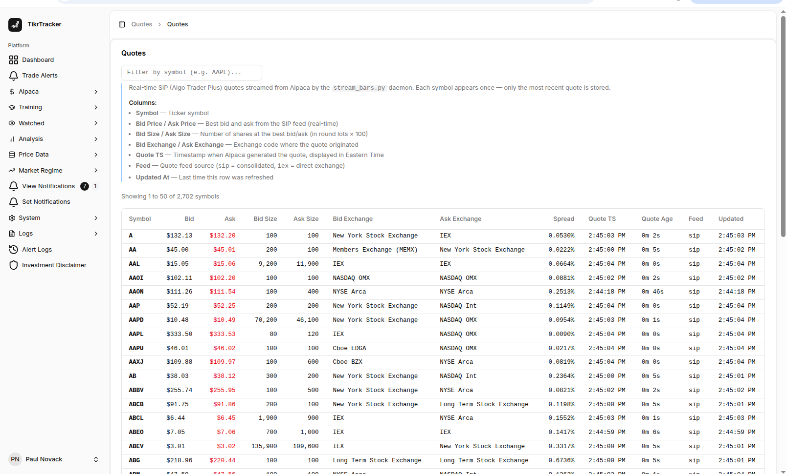

### Market Regime
- [Market Strength](http://127.0.0.1:8080/market-strength) — Daily market strength as STRONG, MODERATE, or WEAK based on explosive bar counts
- [Market Movers](http://127.0.0.1:8080/market-movers) — Daily mover statistics with strength labels, top symbols, and gain percentages

  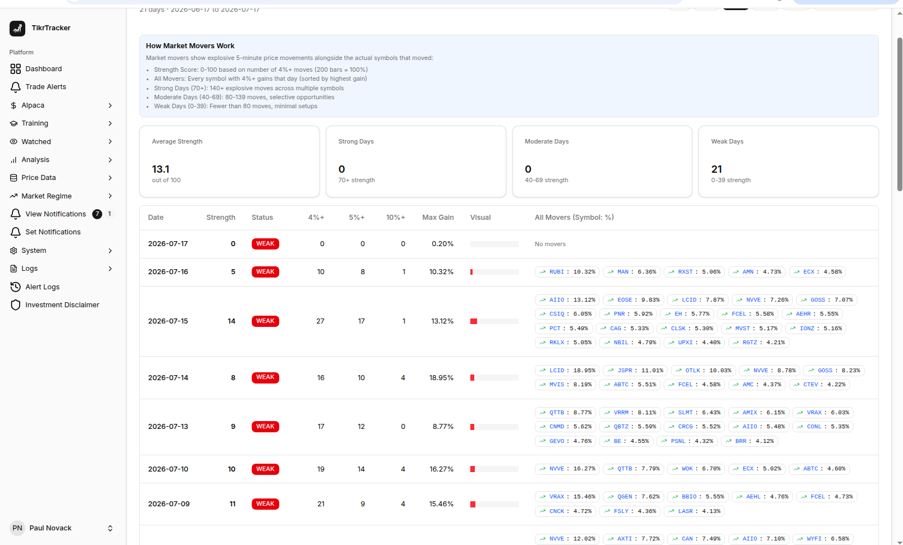

### Notifications
- [View Notifications](http://127.0.0.1:8080/notifications) — User notifications with read/unread state, linked assets, and mark-as-read actions

  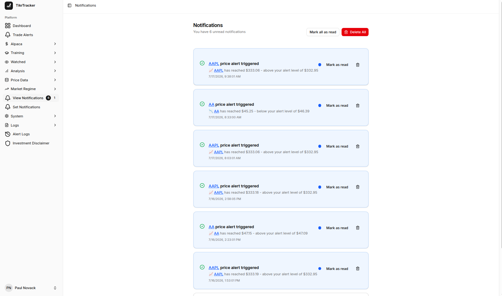
- [Set Notifications](http://127.0.0.1:8080/notifications/settings) — Price alert configurations with % triggers, price thresholds, and enable/disable toggles

  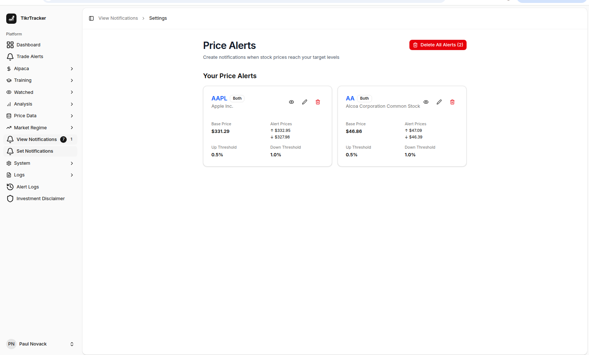

### System Administration
- [HTOP](http://127.0.0.1:8080/logs/htop) — Real-time CPU usage with per-core bars, top processes, and system resource panels

  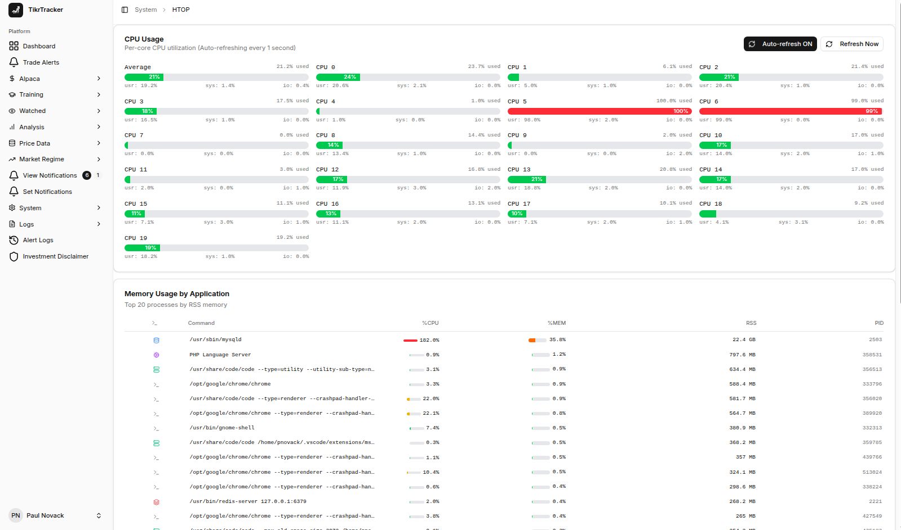
- [CPU Temp](http://127.0.0.1:8080/logs/cpu-temp) — CPU temperature sensor readings with per-section data and fan speeds

  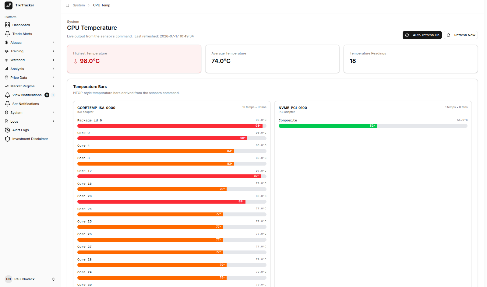
- [Temp Chart](http://127.0.0.1:8080/logs/temp-chart) — Time-series line chart of CPU temperature with multiple sensor series
- [MySQL Health](http://127.0.0.1:8080/mysql-health) — MySQL uptime, connections, slow queries, buffer pool efficiency, and process list

  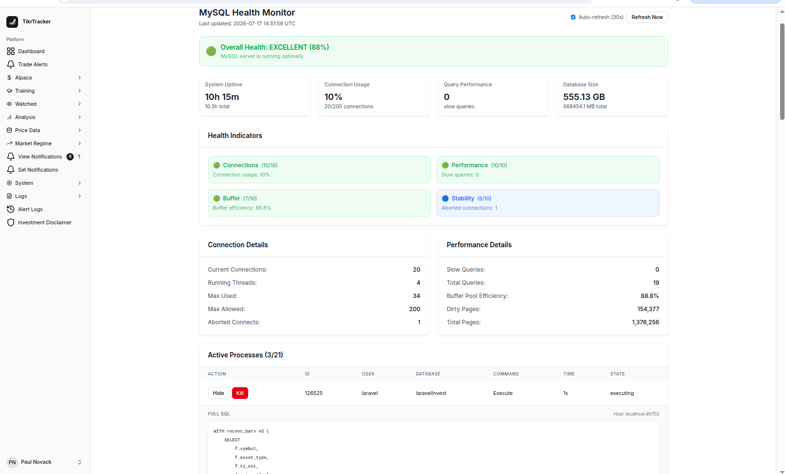
- [Pipeline Observability](http://127.0.0.1:8080/pipeline-observability) — Pipeline health status, hourly throughput charts, skip reasons, and gap alerts

  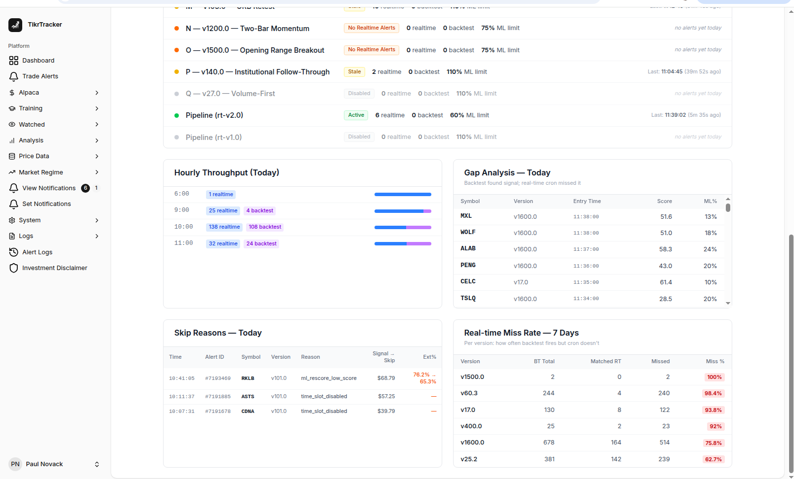
- [Queue Monitor](http://127.0.0.1:8080/queue-monitor) — Queue sizes, worker process states, and Redis memory/client statistics
- [Processes Running](http://127.0.0.1:8080/processes-running) — Running Laravel commands and Python processes with CPU/memory usage

  
- [Trading Settings](http://127.0.0.1:8080/trading-settings) — Paper/live trading configuration, including order enable, loss limits, ML thresholds, position sizing, circuit breakers

  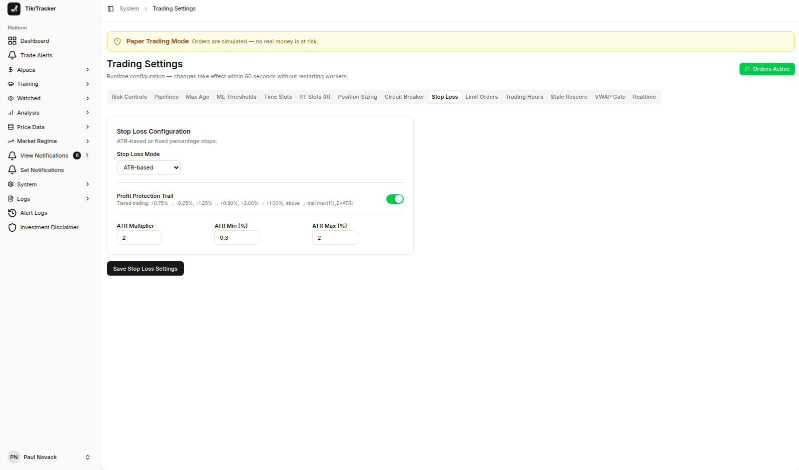
- [Trade Settings 2](http://127.0.0.1:8080/trading-settings-2) — Alpaca credentials, scorer scripts, ML model paths, and pipeline display names
- [Redis Keys](http://127.0.0.1:8080/redis-keys) — Browse Redis key groups by prefix with type breakdowns and key-value inspection
- [Settings Snapshots](http://127.0.0.1:8080/settings-snapshots) — Create and restore named snapshots of trading settings

### Administrative Logs
- [Continuous BT](http://127.0.0.1:8080/logs/continuous-bt) — Log output from continuous backtest runs per pipeline (A–Q)
- [Laravel](http://127.0.0.1:8080/logs/laravel) — Laravel application log with full-text search, match highlighting, and auto-refresh

  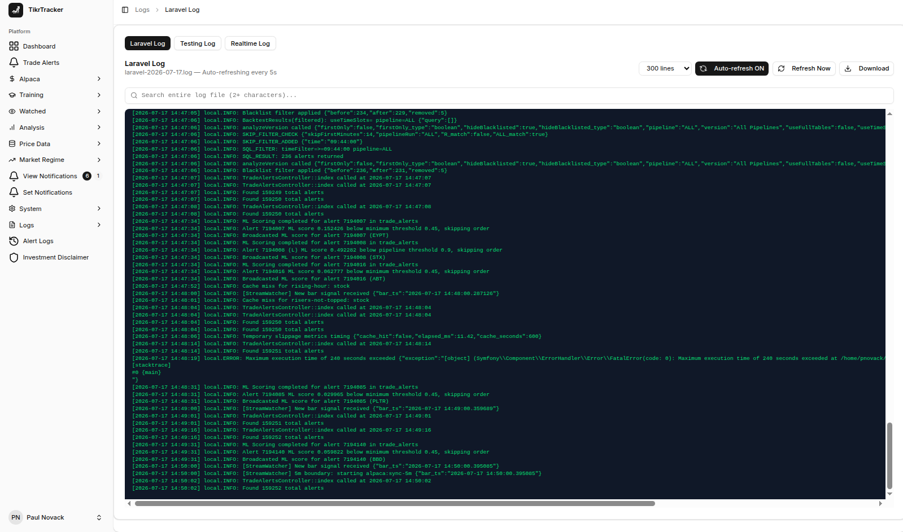
- [Laravel Scheduler](http://127.0.0.1:8080/logs/scheduler) — Scheduler log with full-text search and download capability
- [Streaming Daemons](http://127.0.0.1:8080/logs/streaming) — Bar stream and pipeline watcher logs with color-coded timestamps and levels

  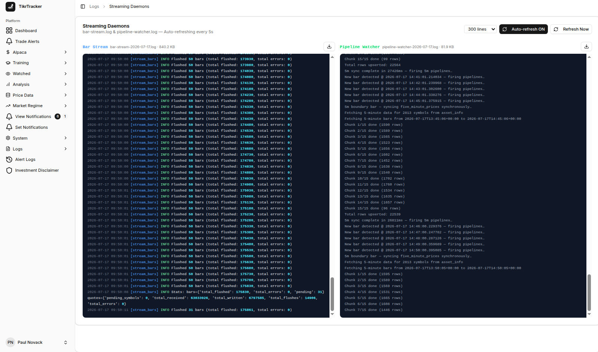
- [Stale Entries](http://127.0.0.1:8080/logs/stale-entries) — Stale entries log for monitoring data staleness issues
- [Real-Time Alerts](http://127.0.0.1:8080/logs/realtime-alerts) — Live real-time alert candidates with bid/ask, spread, VWAP, volume ratios, and rejection reasons

### Other
- [Alert Logs](http://127.0.0.1:8080/alert-logs) — Price alert trigger history with trigger prices, direction, and email delivery statuses

  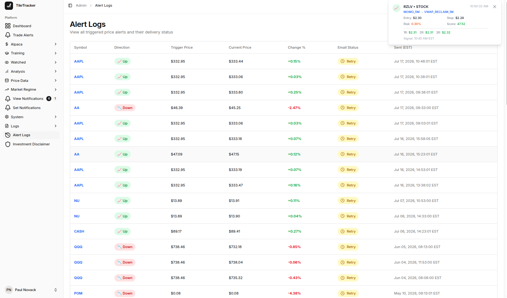
- [Investment Disclaimer](http://127.0.0.1:8080/disclaimer) — Investment disclaimer and acknowledgment required before accessing the application

  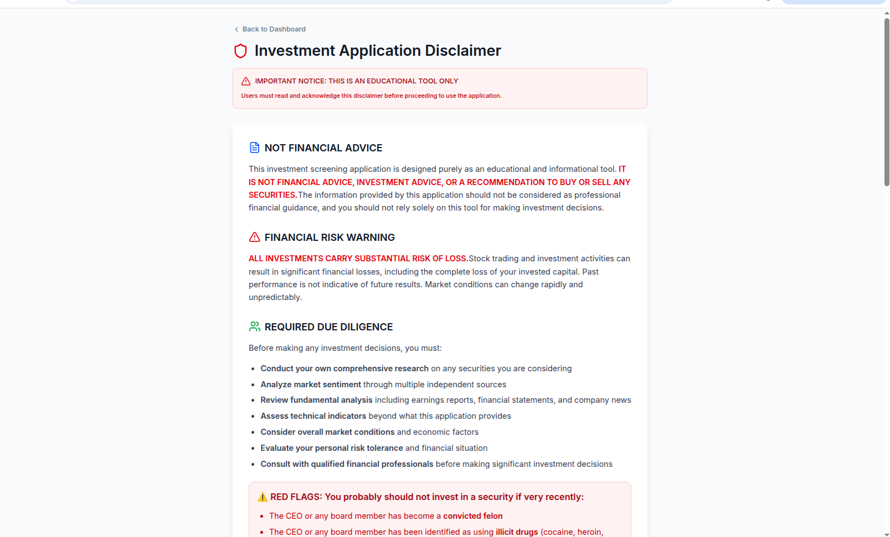

## Risk Notice

TikrTracker is a software project for trading research, analysis, and automation. Algorithmic trading involves substantial risk, including the possible loss of capital. Backtested or paper-trading results do not guarantee future performance. Review the in-application investment disclaimer, validate all configuration settings, and understand the behavior of every strategy before enabling live trading.
