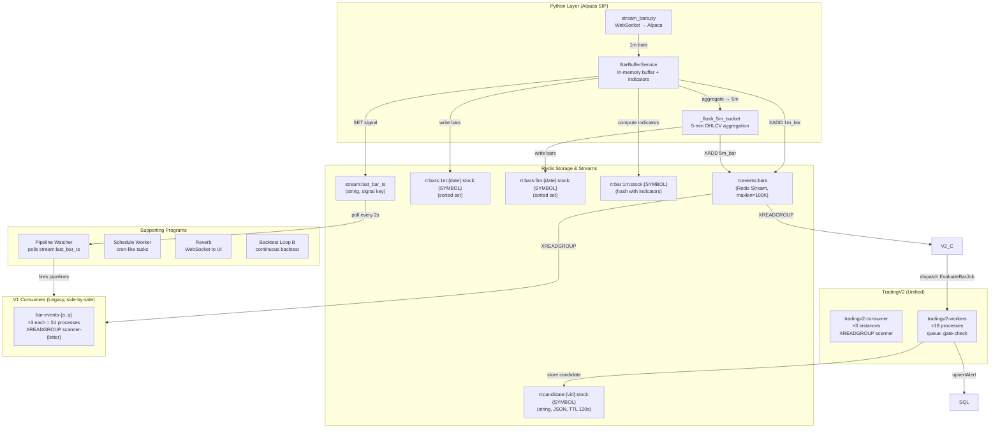

# TradingV2 Implementation — Supervisor & Event System

> Generated 2026-07-28 — Documents the unified TradingV2 bar consumer, gate evaluation,
> queue worker architecture, and the full event flow from Alpaca WebSocket to trade alerts.

---

## Table of Contents

1. [Supervisor Configuration](#supervisor-configuration)
2. [Architecture Overview](#architecture-overview)
3. [Data Ingestion — Python Layer](#data-ingestion--python-layer)
4. [The Redis Stream — `rt:events:bars`](#the-redis-stream--rteventsbars)
5. [TradingV2 Consumer System](#tradingv2-consumer-system)
6. [Queue Workers](#queue-workers)
7. [Laravel Scheduler](#laravel-scheduler)
8. [Pipeline Watcher](#pipeline-watcher)
9. [Auxiliary Programs](#auxiliary-programs)
10. [Complete Event Flow](#complete-event-flow)
11. [Redis Key Reference](#redis-key-reference)
12. [V1 vs V2 Comparison](#v1-vs-v2-comparison)
13. [Deployment Notes](#deployment-notes)

---

## Supervisor Configuration

There are **two** supervisor config files, depending on deployment target:

| File | User | Logs | Environment |
|---|---|---|---|
| `docker/supervisord.conf` | `root` | `/dev/stdout` | Docker container |
| `laravel-invest-worker.conf` | `pnovack` | `storage/logs/` | Bare-metal / production |

Per `SUPERVISOR.md`, `laravel-invest-worker.conf` is the **canonical** config. It is **copied**
(not symlinked) to `/etc/supervisor/conf.d/laravel-invest-worker.conf`.

### Total Process Count

| Component | Programs | Processes per Program | Total Processes |
|---|---|---|---|
| V1 bar-events consumers (a–q) | 17 | 3 | 51 |
| V2 consumer (tradingv2) | 1 | 3 | 3 |
| V2 gate-check workers | 1 | 18 | 18 |
| Default queue workers | 1 | 7 | 7 |
| ML scoring workers | 1 | 6 | 6 |
| ML scoring catch-up | 1 | 3 | 3 |
| Pipeline watcher | 1 | 1 | 1 |
| Reverb WebSocket | 1 | 1 | 1 |
| Scheduler | 1 | 1 | 1 |
| Backtest loop B | 1 | 1 | 1 |
| Bar stream (Python) | 1 | 1 | 1 |
| Bar stream log | 1 | 1 | 1 |
| Vite dev server | 1 | 1 | 1 |
| **Total** | | | **≈96** |

---

## Architecture Overview



---

## Data Ingestion — Python Layer

### Program: `laravel-invest-bar-stream` (1 instance)

**Supervisor config:**
```ini
[program:laravel-invest-bar-stream]
command=/var/www/html/laravel-invest/.venv/bin/python3 \
    /var/www/html/laravel-invest/alpaca_python_api/stream_bars.py
autostart=true
autorestart=true
```

**Source file:** `alpaca_python_api/stream_bars.py`

**What it does:**

1. Loads `.env` and `.secret` for Alpaca credentials
2. Reads `asset_info` from MySQL — subscribes to all symbols where `1_min = 1`
3. Opens WebSocket connection to **Alpaca SIP** (requires Algo Trader Plus)
4. Receives three data streams:
   - **1-minute bars** → routes to `BarBufferService`
   - **Real-time quotes** → writes to `latest_stock_quotes` MySQL table
   - **Updated bars** (corrections) → routes to `BarBufferService`

### BarBufferService

**Source file:** `alpaca_python_api/bar_buffer.py`

**Configuration:**
- `ALPACA_STREAM_FLUSH_SIZE` (default: 50) — bars before flush
- `ALPACA_STREAM_FLUSH_INTERVAL` (default: 10.0) — seconds before flush

**`SymbolIndicatorState` class** maintains per-symbol rolling state for real-time indicators:
- EMA9 (k=0.2), EMA21 (k≈0.0909)
- ATR14 (true range rolling window)
- RVOL (relative volume vs 20-bar average)
- Cumulative VWAP (resets daily at midnight EST)
- 30-bar price history for 30m move

**Warm-up:** `warm_up_all_from_mysql()` — called at startup, bulk-loads today's bars from MySQL
to seed indicator states before subscribing to live data.

**Per-bar processing (`_process`):**
1. Normalizes OHLCV fields
2. Updates VWAP accumulator (resets on new trading day)
3. Updates EMA9/EMA21 (exponential smoothing)
4. Updates ATR14 (true range)
5. Updates RVOL (volume vs prior 20 bars)
6. Computes 30m price move
7. Returns indicator dict

**Flush (`flush`):**
After accumulating `flush_size` bars or `flush_interval` seconds:

| Action | Redis Key / Target | Details |
|---|---|---|
| Write to MySQL | `one_minute_prices` | INSERT ON DUPLICATE KEY UPDATE |
| 1m sorted set | `rt:bars:1m:{YYYYMMDD}:stock:{SYMBOL}` | ZADD with epoch score, trim to 420 entries |
| Latest bar hash | `rt:bar:1m:stock:{SYMBOL}` | HSET with OHLCV + indicators, TTL 3700s |
| **Event stream** | `rt:events:bars` | XADD `{type: "1m_bar", symbol, epoch, ts_est, ...}` |
| Signal key | `stream:last_bar_ts` | SET to current UTC timestamp |

**5-Minute Aggregation (`_maybe_aggregate_5m` / `_flush_5m_bucket`):**

| Action | Details |
|---|---|
| Accumulate | Tracks OHLCV per symbol per 5-minute epoch bucket |
| Boundary detection | When bar epoch crosses 5m boundary, flushes previous bucket |
| 5m sorted set | `rt:bars:5m:{YYYYMMDD}:stock:{SYMBOL}` — ZADD, trim to 100 entries, TTL 172800s |
| **Event stream** | `rt:events:bars` — XADD `{type: "5m_bar", symbol, epoch, ts_est, close, volume}` |

---

## The Redis Stream — `rt:events:bars`

The **central event bus** for the entire trading system.

**Configuration:**
- `maxlen=100000` (approximate)
- Events are appended by Python's `BarBufferService`
- Consumed by V1 and V2 consumers via `XREADGROUP`

### Event Schema

**1-Minute Bar Event:**
```json
{
  "type": "1m_bar",
  "symbol": "AAPL",
  "epoch": "1690459320",
  "ts_est": "2025-07-28 10:02:00",
  "close": "195.3200",
  "volume": "12345"
}
```

**5-Minute Bar Event:**
```json
{
  "type": "5m_bar",
  "symbol": "AAPL",
  "epoch": "1690459200",
  "ts_est": "2025-07-28 10:00:00",
  "close": "195.3200",
  "volume": "52340"
}
```

---

## TradingV2 Consumer System

### Program: `laravel-invest-tradingv2-consumer` (3 instances)

**Supervisor config (Docker):**
```ini
[program:laravel-invest-tradingv2-consumer]
command=php artisan trading:consume-bars --group=scanner --batch=200
numprocs=3
```

**Source file:** `app/Console/Commands/TradingV2ConsumeBarEvents.php`

**Flow:**
1. Creates `BarEventConsumer` with `GateEvaluator` + `AlertVersionRepository`
2. Enters infinite loop — `XREADGROUP COUNT 200 BLOCK 5000` from `rt:events:bars`
3. For each message:
   - Discards events older than 10 minutes
   - Calls `GateEvaluator->evaluate5m()` or `evaluate1m()` **once** per symbol
   - Dispatches single `EvaluateBarJob` with **all gate values + all active alert versions**
   - ACKs the stream message

**Key difference from V1:** One gate computation serves ALL versions, instead of
each pipeline computing gates independently.

### `BarEventConsumer` (TradingV2)

**Source file:** `app/Services/TradingV2/BarEventConsumer.php`

```php
class BarEventConsumer
{
    private const STREAM_KEY = 'rt:events:bars';

    public function __construct(
        private readonly GateEvaluator $evaluator,
        private readonly AlertVersionRepository $versionRepo,
    ) {}

    public function run(string $group, string $consumer, int $batchSize = 200): void
    {
        // 1. Ensure consumer group exists on rt:events:bars
        // 2. XREADGROUP COUNT {batchSize} BLOCK 5000 STREAMS rt:events:bars >
        // 3. For each message:
        //    a. Parse fields (symbol, epoch, ts_est, type)
        //    b. Discard if older than 10 minutes
        //    c. Call evaluator->evaluate5m() or evaluate1m() ONCE
        //    d. Dispatch one EvaluateBarJob with ALL gates + ALL versions
        //    e. XACK the message
    }
}
```

### GateEvaluator

**Source file:** `app/Services/TradingV2/GateEvaluator.php`

Computes all gates from Redis bar data (via `BarSourceInterface`). Uses QQQM as the benchmark
symbol for relative strength calculations.

**5-Minute Gates:**

| Category | Gates |
|---|---|
| Liquidity | `notional`, `price` |
| Volatility | `atr`, `atr_pct` |
| Activity | `rvol_ratio` |
| Momentum | `move_30m_pct`, `move_from_open_pct`, `net_progress_pct`, `three_bar_gain_pct` |
| EMA | `ema9_above_ema21`, `ema9_slope_positive`, `ema_spread_pct` |
| VWAP | `above_vwap`, `above_vwap_pct`, `vwap_distance_min`, `max_above_vwap_pct`, `vwap_violation_count`, `distance_from_ema9_atr` |
| Candle Quality | `green_close`, `green_bar_pct` |
| Pattern | `directional_changes`, `higher_low_count`, `pullback_depth_pct`, `range_contraction`, `closes_near_high_count`, `distance_from_high_atr`, `dist_to_hod_pct` |

**1-Minute Entry Gates (additional):**
- `ema9_distance_pct`, `rvol_2m`, `rvol_5m`, `pullback_from_high_pct`
- `consecutive_up_bars`, `volume_surge_ratio`, `spread_pct`

### Program: `laravel-invest-tradingv2-workers` (18 instances)

**Supervisor config (Docker):**
```ini
[program:laravel-invest-tradingv2-workers]
command=php artisan queue:work redis --queue=gate-check --sleep=0 --tries=1 --max-time=300
numprocs=18
```

**Source file:** `app/Services/TradingV2/Jobs/EvaluateBarJob.php`

**`process5m()` — On 5-Minute Bar:**
1. For each active alert version:
   - Checks 5m gate thresholds (`passesGates($version['gates_5m'])`)
   - Computes version-specific scanner score
   - Checks `entry_score_min` / `entry_score_max` thresholds
   - If passes → stores candidate in Redis: `rt:candidate:{version_id}:stock:{SYMBOL}` (JSON, TTL: 120s)

**`process1m()` — On 1-Minute Bar:**
1. For each active alert version:
   - Reads candidate from Redis (`rt:candidate:{version_id}:stock:{SYMBOL}`)
   - Discards candidates older than 10 minutes
   - Checks 1m entry gate thresholds (`passesGates($version['gates_1m'])`)
   - Builds entry from pre-computed gate values
   - Calls `TradeAlertWriterV1->upsertAlert()` to persist the trade alert

### TradeAlertWriterV1

**Source file:** `app/Services/Trading/TradeAlertWriterV1.php`

Handles alert persistence:
1. Resolves timestamps (EST → UTC)
2. Computes FinBERT sentiment boost from `StockNews`
3. Builds deduplication key (`symbol|date|version|pipeline`)
4. UPSERTs into `trade_alerts` table
5. Fires `TradeAlertCreated` event → triggers `ScoreTradeAlertWithMl` job
6. Logs to `redis-scan` channel

### V1 `BarEventConsumer` (Legacy)

**Source file:** `app/Services/Trading/BarEventConsumer.php`

Per-pipeline pattern — one consumer group per pipeline (e.g., `scanner-a`, `scanner-b`).
Each pipeline loads its own `FiveMinuteSignalScanner` + `OneMinuteEntryFinder` by version
string. The scanner/finder classes are versioned (e.g., `FiveMinuteSignalScannerV1100_0Redis`).

```php
class BarEventConsumer
{
    public function __construct(
        private readonly AbstractSignalScanner $scanner,
        private readonly OneMinuteEntryFinderContract $finder,
        private readonly ?TradeAlertWriterV1 $writer = null,
    ) {}

    public function run(string $group, string $consumer, int $batchSize = 100): void
    {
        // Fast-forward: skip stale backlog on startup
        // XREADGROUP COUNT {batchSize} BLOCK 5000 STREAMS rt:events:bars >
        // 5m_bar → scanner->scan() → if signal, store candidate
        // 1m_bar → check candidate → finder->findEntry() → writer->upsertAlert()
        // XACK
    }
}
```

---

## Queue Workers

| Program | Instances | Queue | Sleep | Tries | Max Time | Purpose |
|---|---|---|---|---|---|---|
| `laravel-invest-worker` | 7 | `default` | 1s | 3 | 3600s | General application jobs |
| `laravel-invest-ml-scoring-worker` | 6 | `ml-scoring` | 1s | 3 | 3600s | ML prediction scoring |
| `laravel-invest-ml-scoring-catchup-worker` | 3 | `ml-scoring-catchup` | 1s | 3 | 3600s | Catch-up ML scoring |
| `laravel-invest-tradingv2-workers` | 18 | `gate-check` | 0s | 1 | 300s | V2 gate evaluation |

**Design notes:**
- Workers recycle after `max-time` seconds to prevent memory bloat
- `gate-check` uses `sleep=0` (no delay between jobs) for minimum latency
- `gate-check` uses `tries=1` (no retry) — bar events are ephemeral
- `default` uses `sleep=1` — general jobs can afford 1s delay

---

## Laravel Scheduler

**Program:** `laravel-invest-scheduler`
**Command:** `php artisan schedule:work`

All schedules defined in `routes/console.php`. Key tasks:

| Frequency | Time (EST) | Command | Purpose |
|---|---|---|---|
| Every 1 min | — | `cpu:record-temperature` | CPU temperature logging |
| Every 30 sec | — | `trade:dispatch-ml-scoring` | Catch-up ML scoring |
| Daily | 8:00 AM | `indicators:calculate-5m` | Pre-market RSI/Bollinger Bands (2-day window) |
| Daily (weekdays) | 8:00 AM | `redis:hydrate-bars` | Warm Redis bar caches |
| Daily | 4:30 PM | `indicators:calculate-5m` | Post-market RSI/Bollinger Bands (1-day window) |
| Daily (weekdays) | 4:15 PM | `universe:generate-quality` | Quality-scored 750-stock universe |
| Daily (weekdays) | 4:15 PM | `analyze:trade-alerts-atr-immediate` | Post-market ATR exit analysis (all pipelines) |
| Daily (weekdays) | 6:00 PM | `market-movers:populate` | Market movers data |
| Daily | 6:00 PM | `analyze:ml-thresholds` | 120-day ML threshold optimization |
| Daily | 6:20 PM | `analyze:ml-thresholds` (7d) | 7-day ML threshold optimization |
| Daily (weekdays) | 8:00 PM | `trading:backfill-one-minute-prices-full` | Backfill 1m prices |
| Daily (weekdays) | 9:00 PM | `trading:backfill-five-minute-prices-full` | Backfill 5m prices |
| Daily | 2:00 AM | `news:fetch-stock` | FinBERT-scored stock news |
| Every 1 min | — | `scan:last-4-1min-up` | 4-consecutive-up bar scanner |
| Every 1 min | — | `scan:three-white-soldiers-live` | Candlestick pattern scanner |
| Every 15 min | 9:45 AM–2:30 PM | `trading:intraday-risk-check` | Intraday P&L halt check |
| Daily (weekdays) | 4:15 PM | `trading:auto-risk-check --mode=risk` | Auto switch to paper trading |
| Daily (weekdays) | 9:00 AM | `trading:auto-risk-check --mode=resume` | Auto resume live trading |

> **Note:** The old per-pipeline cron entries (`trade:pipeline-a` through `trade:pipeline-q`)
> are **commented out** and replaced by the pipeline watcher.

---

## Pipeline Watcher

### Program: `laravel-invest-pipeline-watcher` (1 instance)

**Supervisor config:**
```ini
[program:laravel-invest-pipeline-watcher]
command=bash scripts/log-pipeline-watcher.sh
```

**Wraps:** `php artisan stream:watch-and-run-pipelines`

**Source file:** `app/Console/Commands/StreamWatchAndRunPipelines.php`

**How it works:**
1. Polls Redis key `stream:last_bar_ts` every 2 seconds
2. When a new timestamp is detected (set by Python's `BarBufferService.flush()`):
   - Fires all 1-minute pipelines (A, B, C, D, E, F, G, I, J, K, M, N, Q)
   - Fires ML scoring dispatch
3. On 5-minute boundary bars (epoch % 300 == 0):
   - Additionally fires 5-minute pipelines (E, H, L, O)
4. Implements per-pipeline throttling to prevent duplicate runs within the same bar

**1-Minute Pipelines (14 total):**
```
trade:pipeline-a stock --top=50 --lookback=15 --stale=12 --before=6
trade:pipeline-b stock --top=50 --lookback=15 --stale=12 --before=6
trade:pipeline-c stock --top=50 --lookback=15 --stale=12 --before=6
trade:pipeline-d stock --top=50 --lookback=15 --stale=12 --before=6
trade:pipeline-e stock --top=50 --lookback=15 --stale=12 --before=6
trade:pipeline-f stock --top=25 --lookback=15 --before=8 --after=10 --stale=12
trade:pipeline-g stock --top=25 --lookback=15 --stale=12 --before=6
trade:pipeline-i stock --top=50 --lookback=15 --stale=12 --before=6
trade:pipeline-j stock --top=25 --lookback=60 --stale=12 --before=6
trade:pipeline-k stock --top=50 --stale=12 --fill=close --before=8
trade:pipeline-m stock --stale=12
trade:pipeline-n stock --stale=12 --before=6
trade:pipeline-q stock --top=60 --lookback=15 --stale=12 --before=6
trade:dispatch-ml-scoring --age=10 --limit=50 --no-interaction
```

**5-Minute Pipelines (4 total):**
```
trade:pipeline-e stock --top=50 --lookback=15 --stale=12 --before=6
trade:pipeline-h stock --top=50 --lookback=60 --minMove=0.4 --volMult=1.2 --stale=12 --before=6
trade:pipeline-l stock --top=50 --lookback=120 --minMove=0.4 --volMult=1.2 --stale=12 --before=6
trade:pipeline-o stock --stale=12 --before=8
```

---

## Auxiliary Programs

| Program | Command | Purpose |
|---|---|---|
| `laravel-invest-reverb` | `php artisan reverb:start` | Laravel Reverb WebSocket server for real-time UI updates |
| `laravel-invest-vite` | `npm run dev -- --host 0.0.0.0` | Vite dev server for HMR in development |
| `laravel-invest-bar-stream-log` | `scripts/log-bar-stream.sh` | Wraps Python bar stream with dated log rotation |
| `laravel-invest-backtest-b` | `scripts/continuous-back/b-backtest_comparison.sh` | Continuous Pipeline B backtest loop (30s cycle on today's date) |
| `laravel-invest-hydrate-bars` | `php artisan redis:hydrate-bars` | Manual Redis bar warm-up (autostart=false) |

---

## Complete Event Flow

### End-to-End: Alpaca WebSocket → Trade Alert

```
Step 1  [Python]  Alpaca SIP WebSocket pushes 1-minute bar
                  → stream_bars.py receives Bar object

Step 2  [Python]  BarBufferService.add(bar)
                  → SymbolIndicatorState._process()
                  → Computes VWAP, EMA9/21, ATR14, RVOL, 30m move

Step 3  [Python]  BarBufferService.flush()
                  → INSERT INTO one_minute_prices (MySQL)
                  → ZADD rt:bars:1m:{date}:stock:{SYMBOL} (Redis sorted set)
                  → HSET rt:bar:1m:stock:{SYMBOL} (Redis hash + indicators)
                  → XADD rt:events:bars {type:"1m_bar", ...} (Redis stream)
                  → SET stream:last_bar_ts (signal for pipeline watcher)

Step 4  [Python]  BarBufferService._maybe_aggregate_5m()
                  → Accumulates 1m bars into 5m OHLCV bucket
                  → When boundary crossed:
                    → ZADD rt:bars:5m:{date}:stock:{SYMBOL}
                    → XADD rt:events:bars {type:"5m_bar", ...}

Step 5  [PHP]    Pipeline Watcher detects new stream:last_bar_ts
                  → Fires all trade:pipeline-* commands as subprocesses
                  → Each pipeline scans quotes/candidates independently

Step 6a [PHP V1] bar-events-{letter} consumer (XREADGROUP scanner-{letter})
                  → 5m_bar: FiveMinuteSignalScannerRedis → store candidate
                  → 1m_bar: check candidate → OneMinuteEntryFinderRedis →
                    TradeAlertWriterV1.upsertAlert()

Step 6b [PHP V2] tradingv2-consumer (XREADGROUP scanner)
                  → GateEvaluator.evaluate5m() or evaluate1m()
                  → Computes ALL gates once from Redis bars
                  → Dispatch EvaluateBarJob (queue: gate-check)

Step 7  [PHP V2] EvaluateBarJob.handle()
                  → 5m: iterate all versions, check gates, store candidates
                  → 1m: iterate all versions, check candidates + entry gates,
                    TradeAlertWriterV1.upsertAlert()

Step 8  [PHP]    TradeAlertWriterV1.upsertAlert()
                  → Resolve timestamps (EST → UTC)
                  → Compute sentiment boost (FinBERT)
                  → UPSERT trade_alerts row
                  → Fire TradeAlertCreated event → ScoreTradeAlertWithMl job
                  → Log to redis-scan channel

Step 9  [PHP]    Reverb broadcasts TradeAlertCreated to WebSocket clients
                  → UI updates in real-time
```

---

## Redis Key Reference

| Key Pattern | Type | TTL | Purpose |
|---|---|---|---|
| `rt:events:bars` | Stream | maxlen=100K | Central bar event bus |
| `rt:bars:1m:{YYYYMMDD}:stock:{SYMBOL}` | Sorted Set | 172800s | 1-minute bar history |
| `rt:bars:5m:{YYYYMMDD}:stock:{SYMBOL}` | Sorted Set | 172800s | 5-minute bar history |
| `rt:bar:1m:stock:{SYMBOL}` | Hash | 3700s | Latest bar + indicators |
| `rt:candidate:{version_id}:stock:{SYMBOL}` | String (JSON) | 120s | Active signal candidate |
| `stream:last_bar_ts` | String | — | Signal for pipeline watcher |
| `stream:last_quote_ts` | String | — | Signal for quote watcher |
| `stream:quote:{SYMBOL}` | Hash | 3600s | Latest quote snapshot |

---

## V1 vs V2 Comparison

| Aspect | V1 (Legacy) | V2 (Unified) |
|---|---|---|
| Consumer programs | 17 (a–q), ×3 each | 1, ×3 |
| Consumer groups | 17 (scanner-a through scanner-q) | 1 (scanner) |
| Worker processes | Embedded in consumers | 18 dedicated gate-check workers |
| Gate computation | Per-pipeline, computed in each consumer | Once per bar, shared across all versions |
| Version management | Hardcoded per pipeline via config | Dynamic via AlertVersionRepository |
| Config changes | Restart consumer | Picked up by next job |
| Queue | None (synchronous) | Redis `gate-check` queue |
| Deployment | Full restart of all 51 processes | Just restart 3 consumers |

---

## Deployment Notes

### Config File Location

The canonical config lives at:
```
/var/www/html/laravel-invest/laravel-invest-worker.conf
```

It is **copied** to:
```
/etc/supervisor/conf.d/laravel-invest-worker.conf
```

### Recommended: Symlink Instead of Copy

```bash
sudo rm /etc/supervisor/conf.d/laravel-invest-worker.conf
sudo ln -s /var/www/html/laravel-invest/laravel-invest-worker.conf \
           /etc/supervisor/conf.d/laravel-invest-worker.conf
sudo supervisorctl reread && sudo supervisorctl update
```

### Reloading After Config Changes

```bash
# After editing laravel-invest-worker.conf:
sudo cp /var/www/html/laravel-invest/laravel-invest-worker.conf \
       /etc/supervisor/conf.d/laravel-invest-worker.conf
sudo supervisorctl reread
sudo supervisorctl update
```

### Useful Supervisor Commands

```bash
# View all program statuses
sudo supervisorctl status

# Restart specific programs
sudo supervisorctl restart laravel-invest-tradingv2-consumer:*
sudo supervisorctl restart laravel-invest-tradingv2-workers:*

# Tail logs
sudo supervisorctl tail -f laravel-invest-worker
sudo supervisorctl tail -f laravel-invest-tradingv2-consumer

# View V2 consumer logs
tail -f storage/logs/tradingv2-consumer.log
```

---

## Deprecation Plan

The V1 bar-events consumers (`bar-events-{a..q}` — 51 total processes) run **side-by-side**
with V2. Once V2 is proven stable in production:

1. Remove all `[program:laravel-invest-bar-events-*]` sections from supervisor config
2. Remove `app/Console/Commands/ConsumeBarEvents.php` (V1 command)
3. Remove V1 scanner/finder classes when no longer referenced
4. Keep `TradeAlertWriterV1` (shared by both V1 and V2)

---

## Key Files Reference

| File | Role |
|---|---|
| `laravel-invest-worker.conf` | Canonical supervisor config (bare-metal) |
| `docker/supervisord.conf` | Docker supervisor config |
| `SUPERVISOR.md` | Supervisor setup & maintenance docs |
| `alpaca_python_api/stream_bars.py` | Alpaca WebSocket → bar stream daemon |
| `alpaca_python_api/bar_buffer.py` | Bar buffer, indicator computation, Redis writes |
| `app/Console/Commands/TradingV2ConsumeBarEvents.php` | V2 consumer entry point |
| `app/Console/Commands/ConsumeBarEvents.php` | V1 consumer entry point |
| `app/Services/TradingV2/BarEventConsumer.php` | V2 stream consumer loop |
| `app/Services/Trading/BarEventConsumer.php` | V1 stream consumer loop |
| `app/Services/TradingV2/GateEvaluator.php` | Unified gate computation |
| `app/Services/TradingV2/Jobs/EvaluateBarJob.php` | Per-bar gate-check job |
| `app/Services/Trading/TradeAlertWriterV1.php` | Alert persistence (shared V1+V2) |
| `app/Console/Commands/StreamWatchAndRunPipelines.php` | Pipeline watcher daemon |
| `routes/console.php` | Laravel scheduler definitions |
| `scripts/log-bar-stream.sh` | Bar stream log wrapper |
| `scripts/log-pipeline-watcher.sh` | Pipeline watcher log wrapper |
| `scripts/continuous-back/b-backtest_comparison.sh` | Continuous backtest loop |
